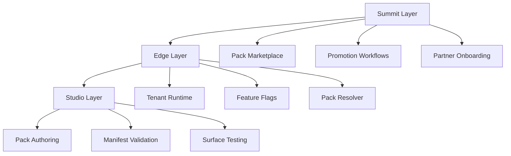

## What is AICR Platform?

AICR (AICodeRally Platform) is a **self-aware, AI-native platform** that orchestrates the creation, operation, and commercialization of software products through a sophisticated three-layer architecture.

### Core Innovation

AICR is **self-documenting and self-aware** - it understands its own architecture through indexed canonical documentation that agents can query in real-time. This enables AI agents to work autonomously while maintaining architectural consistency.

<CardGroup cols={2}>
  <Card
    title="Studio Layer"
    icon="code"
    href="/docs/studio/overview"
  >
    Development and authoring environment for building packs
  </Card>
  <Card
    title="Edge Layer"
    icon="server"
    href="/docs/edge/overview"
  >
    Tenant runtime and business operations
  </Card>
  <Card
    title="Summit Layer"
    icon="building"
    href="/docs/summit/overview"
  >
    Enterprise governance and marketplace
  </Card>
  <Card
    title="Pack System"
    icon="cube"
    href="/docs/concepts/pack-system"
  >
    Versioned capability bundles with deterministic resolution
  </Card>
</CardGroup>

## Key Features

<AccordionGroup>
  <Accordion icon="brain" title="Self-Aware Architecture">
    AICR understands its own architecture through indexed canonical documentation. AI agents can query the platform's structure, contracts, and patterns in real-time to make informed decisions.
  </Accordion>

  <Accordion icon="robot" title="14 Specialized AI Agents">
    Collaborative AI agent system with clear role separation including Builder, Designer, OpsChief, QA, and more. Each agent has persistent memory and understands the platform architecture.
  </Accordion>

  <Accordion icon="database" title="240-Table Database Architecture">
    Enterprise-grade database with 48 tenant-scoped models, 41 enums, and comprehensive audit trails. All access through Prisma ORM with contract enforcement.
  </Accordion>

  <Accordion icon="shield-check" title="Enforced Governance">
    Contracts validated at runtime through guard.ts. Three laws locked (Neon Everywhere, Neon Branches, Prisma Only) with zero exceptions.
  </Accordion>

  <Accordion icon="cube" title="Deterministic Pack System">
    Versioned capability bundles with manifest validation, promotion workflows, and audit trails. Same inputs → same outputs guaranteed.
  </Accordion>

  <Accordion icon="users" title="Multi-Tenant by Design">
    48 tenant-scoped models with automatic isolation. Every tenant operation includes tenantId validation and authorization checks.
  </Accordion>
</AccordionGroup>

## Three-Layer Architecture

### Studio → Edge → Summit

1. **Studio**: Build packs, validate manifests, test surfaces
2. **Edge**: Deploy to tenants, activate features, monitor operations
3. **Summit**: Manage marketplace, promote packs, oversee partners

## Quick Links

<CardGroup cols={2}>
  <Card
    title="Quickstart"
    icon="rocket"
    href="/docs/quickstart"
  >
    Get started with AICR in 5 minutes
  </Card>
  <Card
    title="Architecture"
    icon="sitemap"
    href="/docs/architecture"
  >
    Understand the platform architecture
  </Card>
  <Card
    title="API Reference"
    icon="code"
    href="/api-reference/overview"
  >
    Explore the AICR API
  </Card>
  <Card
    title="GitHub"
    icon="github"
    href="https://github.com/AICodeRally/AICR"
  >
    View the source code
  </Card>
</CardGroup>

## Platform Statistics

| Metric | Value |
|--------|-------|
| **Total Tables** | 240 |
| **Control Centers** | 19 |
| **AI Agents** | 14 |
| **Enums** | 41 |
| **Tenant-Scoped Models** | 48 |
| **Schema Lines** | 286,668 |

## Strategic Differentiators

<Check>**Self-awareness** - No other platform queries its own architecture in real-time</Check>
<Check>**Enforced governance** - Contracts validated at runtime, not just documented</Check>
<Check>**Multi-tenant by design** - 48 tenant-scoped models with automatic isolation</Check>
<Check>**Deterministic resolution** - Pack system guarantees same inputs → same outputs</Check>
<Check>**AI-native design** - 14 specialized agents with persistent memory</Check>

## Next Steps

<Steps>
  <Step title="Read the Quickstart">
    Get AICR running locally in 5 minutes
  </Step>
  <Step title="Understand the Architecture">
    Learn about the three-layer system and pack architecture
  </Step>
  <Step title="Explore Control Centers">
    Dive into the 19 interconnected control centers
  </Step>
  <Step title="Build Your First Pack">
    Create and deploy a capability pack
  </Step>
</Steps>
