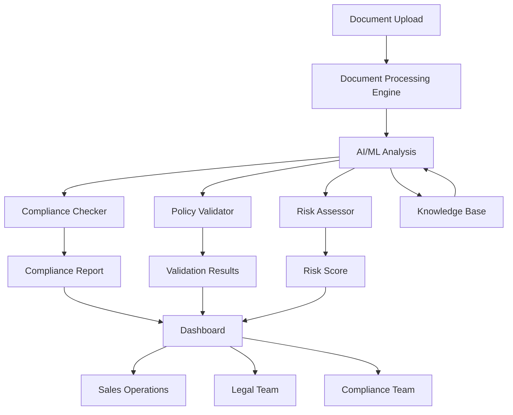

<Note>
  **Coming Soon**: Document Intelligence is currently in development. This documentation represents the planned features and capabilities. Join our waitlist to be notified when the platform launches.
</Note>

## What is Document Intelligence?

Document Intelligence is an **AI-powered sales document analyzer** designed to process, analyze, and validate sales documents for compliance, policy adherence, and risk assessment. Leveraging advanced natural language processing and machine learning, Document Intelligence helps sales operations teams ensure document quality, compliance, and consistency at scale.

<CardGroup cols={2}>
  <Card
    title="Document Processing"
    icon="file-lines"
    href="/features/document-processing"
  >
    Automated document ingestion, extraction, and classification
  </Card>
  <Card
    title="Compliance Analysis"
    icon="shield-check"
    href="/features/compliance-analysis"
  >
    Real-time compliance checking against regulatory requirements
  </Card>
  <Card
    title="Policy Validation"
    icon="clipboard-check"
    href="/features/policy-validation"
  >
    Validate documents against company policies and standards
  </Card>
  <Card
    title="AI-Powered Insights"
    icon="brain"
    href="/features/ai-insights"
  >
    Intelligent recommendations and anomaly detection
  </Card>
</CardGroup>

## Planned Key Features

<AccordionGroup>
  <Accordion icon="file-import" title="Document Processing">
    Automated document ingestion from multiple sources (email, CRM, file storage). Intelligent extraction of key information including parties, terms, pricing, and dates. Automatic document classification by type (proposals, contracts, quotes, MSAs). OCR capabilities for scanned documents and images.
  </Accordion>

  <Accordion icon="scale-balanced" title="Compliance Analysis">
    Real-time analysis of documents against regulatory requirements (GDPR, SOC 2, industry-specific regulations). Automated detection of compliance gaps and risks. Generate compliance reports for audits and reviews. Track compliance trends over time. Integration with compliance management systems.
  </Accordion>

  <Accordion icon="file-check" title="Policy Validation">
    Validate sales documents against company policies (pricing, discounting, terms, approval thresholds). Customizable validation rules and workflows. Automated approval routing based on document content. Version control for policy changes with audit trails. Exception management and override workflows.
  </Accordion>

  <Accordion icon="magnifying-glass-chart" title="Risk Assessment">
    AI-powered risk scoring for sales documents. Identify unusual terms, non-standard clauses, and potential red flags. Risk heat maps across document portfolio. Automated alerts for high-risk documents. Risk trend analysis and reporting.
  </Accordion>

  <Accordion icon="lightbulb" title="AI-Powered Insights">
    Natural language processing to understand document intent and meaning. Anomaly detection to flag unusual patterns or terms. Smart recommendations for document improvements. Predictive analytics for approval likelihood. Learning system that improves over time.
  </Accordion>

  <Accordion icon="chart-line" title="Analytics & Reporting">
    Comprehensive dashboards for document intelligence metrics. Track document processing times, approval rates, and compliance scores. Identify bottlenecks in document workflows. Benchmark document quality across teams and regions. Export reports for stakeholders and auditors.
  </Accordion>
</AccordionGroup>

## Platform Architecture (Planned)

### Document Intelligence Workflow (Planned)

1. **Ingestion**: Documents uploaded or automatically captured from various sources
2. **Processing**: AI extracts key information and classifies document type
3. **Analysis**: Document analyzed for compliance, policy adherence, and risk
4. **Validation**: Results compared against rules and requirements
5. **Alerting**: Stakeholders notified of issues, approvals, or anomalies
6. **Reporting**: Generate reports and insights for continuous improvement

## Quick Links

<CardGroup cols={2}>
  <Card
    title="Product Roadmap"
    icon="road"
    href="/docs/roadmap"
  >
    View our development timeline and upcoming features
  </Card>
  <Card
    title="Architecture Overview"
    icon="sitemap"
    href="/docs/architecture"
  >
    Understand the planned platform architecture
  </Card>
  <Card
    title="Join Waitlist"
    icon="envelope"
    href="https://bluehorizonsgroup.com/document-intelligence"
  >
    Be notified when Document Intelligence launches
  </Card>
  <Card
    title="Request Demo"
    icon="presentation-screen"
    href="https://bluehorizonsgroup.com/demo"
  >
    Schedule a demo of the platform
  </Card>
</CardGroup>

## Expected Benefits

<CardGroup cols={2}>
  <Card title="Reduce Risk" icon="shield-halved">
    Identify compliance and policy violations before they become problems
  </Card>
  <Card title="Save Time" icon="clock">
    Automate document review and reduce manual review time by 80%
  </Card>
  <Card title="Improve Quality" icon="certificate">
    Ensure all sales documents meet quality and compliance standards
  </Card>
  <Card title="Faster Approvals" icon="gauge-high">
    Accelerate document approval cycles with automated validation
  </Card>
</CardGroup>

## Planned Core Capabilities

| Feature | Description |
|---------|-------------|
| **Document Ingestion** | Multi-channel document capture (email, CRM, storage, upload) |
| **Intelligent Extraction** | AI-powered extraction of key terms, parties, dates, and pricing |
| **Classification** | Automatic document type classification and categorization |
| **Compliance Checking** | Real-time validation against regulatory requirements |
| **Policy Validation** | Automated checking against company policies and standards |
| **Risk Scoring** | AI-based risk assessment with anomaly detection |
| **Approval Workflows** | Configurable approval routing based on document content |
| **Version Control** | Track document versions and changes over time |
| **Audit Trails** | Complete history of document reviews and approvals |
| **Analytics Dashboard** | Comprehensive metrics and insights on document intelligence |

## Target Use Cases

<Check>**Sales Operations** - Ensure all sales documents comply with policies and regulations</Check>
<Check>**Legal Teams** - Automate contract review and identify legal risks</Check>
<Check>**Compliance Officers** - Monitor document compliance at scale</Check>
<Check>**Revenue Operations** - Streamline quote and proposal approval processes</Check>
<Check>**Finance Teams** - Validate pricing and discount approvals</Check>

## Document Types Supported (Planned)

<CardGroup cols={2}>
  <Card title="Sales Proposals" icon="file-invoice">
    Proposals, quotes, and pricing documents
  </Card>
  <Card title="Contracts" icon="file-contract">
    Sales agreements, MSAs, SOWs, amendments
  </Card>
  <Card title="Order Forms" icon="file-signature">
    Purchase orders, work orders, change orders
  </Card>
  <Card title="NDAs & Legal" icon="file-shield">
    Non-disclosure agreements, legal documents
  </Card>
  <Card title="Invoices" icon="file-invoice-dollar">
    Invoices, credit memos, payment terms
  </Card>
  <Card title="Custom Documents" icon="file-plus">
    Organization-specific document types
  </Card>
</CardGroup>

## AI Capabilities (Planned)

<AccordionGroup>
  <Accordion icon="wand-magic-sparkles" title="Intelligent Extraction">
    Advanced NLP models extract structured data from unstructured documents. Identify parties, dates, monetary amounts, key terms, obligations, and more. Handle multiple languages and document formats. Learn from corrections to improve accuracy over time.
  </Accordion>

  <Accordion icon="magnifying-glass-dollar" title="Anomaly Detection">
    Machine learning models identify unusual patterns, terms, or clauses. Flag documents with non-standard pricing, terms, or conditions. Detect potential fraud or manipulation. Alert reviewers to documents requiring extra scrutiny.
  </Accordion>

  <Accordion icon="lightbulb-on" title="Smart Recommendations">
    AI suggests improvements to document language, structure, and terms. Recommend standard clauses to include or remove. Identify missing required information. Suggest optimal approval paths based on document content.
  </Accordion>

  <Accordion icon="comments" title="Natural Language Queries">
    Ask questions about documents in natural language. "Show me all contracts with discounts over 20%" or "Which proposals are waiting for legal approval?" AI interprets questions and retrieves relevant documents.
  </Accordion>
</AccordionGroup>

## Planned Technology Stack

| Component | Technology |
|-----------|-----------|
| **Frontend** | Next.js 15, React 19, TypeScript |
| **Backend** | Node.js, Python (for AI/ML), GraphQL |
| **Database** | PostgreSQL with full-text search |
| **AI/ML** | TensorFlow, spaCy, Hugging Face Transformers |
| **OCR** | Tesseract, Google Cloud Vision API |
| **NLP** | OpenAI GPT-4, Claude, custom models |
| **Document Storage** | AWS S3, Azure Blob Storage |
| **Security** | SOC 2 Type II, encryption at rest and in transit |
| **Hosting** | Vercel, AWS for AI/ML processing |

## Development Roadmap

<Steps>
  <Step title="Q2 2026 - Alpha Release">
    Core document processing and extraction capabilities. Basic compliance checking. Limited beta access for design partners.
  </Step>
  <Step title="Q3 2026 - Beta Release">
    Policy validation engine and approval workflows. Risk scoring and analytics dashboards. Expanded beta program.
  </Step>
  <Step title="Q4 2026 - AI Features">
    Advanced NLP for intelligent extraction. Anomaly detection and smart recommendations. Natural language query interface.
  </Step>
  <Step title="Q1 2027 - General Availability">
    Full platform launch with complete feature set. Enterprise integrations and advanced security features.
  </Step>
</Steps>

## Integration Ecosystem (Planned)

<CardGroup cols={3}>
  <Card title="CRM Systems" icon="address-book">
    Salesforce, HubSpot, Microsoft Dynamics
  </Card>
  <Card title="Contract Management" icon="file-contract">
    DocuSign, Adobe Sign, PandaDoc
  </Card>
  <Card title="Storage" icon="cloud">
    Google Drive, OneDrive, Dropbox, Box
  </Card>
  <Card title="Communication" icon="envelope">
    Email (Gmail, Outlook), Slack, Teams
  </Card>
  <Card title="Legal Tech" icon="gavel">
    Legal management systems, CLM platforms
  </Card>
  <Card title="Compliance Tools" icon="shield-check">
    GRC platforms, compliance management systems
  </Card>
</CardGroup>

## Compliance Support (Planned)

<CardGroup cols={2}>
  <Card title="Data Privacy" icon="user-lock">
    GDPR, CCPA, HIPAA compliance checking
  </Card>
  <Card title="Financial Regulations" icon="landmark">
    SOX, PCI-DSS, financial services regulations
  </Card>
  <Card title="Industry Standards" icon="certificate">
    ISO standards, industry-specific compliance
  </Card>
  <Card title="Export Controls" icon="globe">
    ITAR, EAR, export compliance validation
  </Card>
</CardGroup>

## Why Choose Document Intelligence?

<Check>**AI-Powered** - Leverage advanced NLP and ML for intelligent document analysis</Check>
<Check>**Real-Time Validation** - Catch compliance and policy issues before documents are finalized</Check>
<Check>**Automated Workflows** - Route documents automatically based on content and risk</Check>
<Check>**Risk Prevention** - Identify and mitigate document risks proactively</Check>
<Check>**Easy Integration** - Connect with existing CRM, CLM, and storage systems</Check>
<Check>**Continuous Learning** - AI models improve accuracy over time with usage</Check>

## Join the Waitlist

<Card title="Early Access Program" icon="rocket">
  Be among the first to experience Document Intelligence when it launches. Join our early access program for:
  - **Priority Access** - Get access before general availability
  - **Special Pricing** - Lock in discounted pricing for life
  - **Product Input** - Influence product roadmap and features
  - **Dedicated Support** - Work directly with our product team

  [Sign up now](https://bluehorizonsgroup.com/document-intelligence)
</Card>

## Target Markets

<CardGroup cols={2}>
  <Card title="Technology Companies" icon="laptop-code">
    SaaS, software, and technology sales organizations
  </Card>
  <Card title="Financial Services" icon="building-columns">
    Banks, insurance, investment firms
  </Card>
  <Card title="Healthcare" icon="heart-pulse">
    Healthcare providers, medical device companies
  </Card>
  <Card title="Professional Services" icon="briefcase">
    Consulting, legal, accounting firms
  </Card>
  <Card title="Manufacturing" icon="industry">
    Industrial equipment, complex B2B sales
  </Card>
  <Card title="Government Contractors" icon="building-flag">
    Organizations with stringent compliance requirements
  </Card>
</CardGroup>

## Expected Pricing Tiers (TBD)

| Tier | Target Audience | Expected Features |
|------|-----------------|-------------------|
| **Starter** | Small teams (up to 100 docs/month) | Basic processing and compliance checking |
| **Professional** | Mid-market (up to 1,000 docs/month) | Full feature set with AI insights |
| **Enterprise** | Large orgs (unlimited docs) | Advanced AI, custom models, dedicated support |
| **Custom** | Enterprise customers | On-premise deployment, custom compliance rules |

## Security & Privacy

<AccordionGroup>
  <Accordion icon="lock" title="Data Security">
    SOC 2 Type II certified infrastructure. End-to-end encryption for documents at rest and in transit. Role-based access controls and audit logging. Regular security audits and penetration testing.
  </Accordion>

  <Accordion icon="shield-check" title="Compliance">
    GDPR and CCPA compliant with data privacy controls. HIPAA-ready for healthcare documents. ISO 27001 information security standards. Industry-specific compliance certifications.
  </Accordion>

  <Accordion icon="user-shield" title="Privacy">
    Documents processed in secure, isolated environments. No customer data used for training AI models without consent. Right-to-be-forgotten and data portability support. Configurable data retention policies.
  </Accordion>
</AccordionGroup>

## Stay Updated

<CardGroup cols={2}>
  <Card title="Blog Updates" icon="newspaper">
    Follow our blog for product updates and best practices
  </Card>
  <Card title="Newsletter" icon="envelope-open-text">
    Subscribe to our monthly newsletter
  </Card>
  <Card title="Webinars" icon="video">
    Attend product demos and document intelligence webinars
  </Card>
  <Card title="Community" icon="users">
    Join our community of sales and legal operations professionals
  </Card>
</CardGroup>
