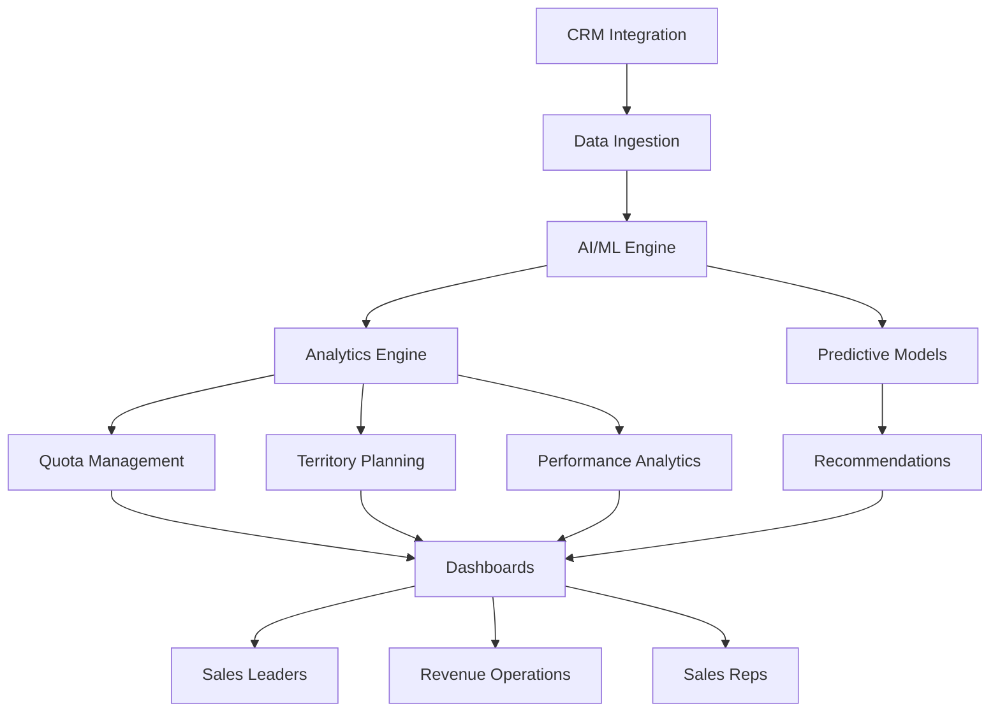

<Note>
  **Coming Soon**: IntelligentSPM is currently in development. This documentation represents the planned features and capabilities. Join our waitlist to be notified when the platform launches.
</Note>

## What is IntelligentSPM?

IntelligentSPM is an **AI-powered Sales Performance Management platform** designed to optimize sales operations through intelligent quota management, territory planning, performance analytics, and incentive design. By leveraging artificial intelligence and machine learning, IntelligentSPM helps revenue leaders make data-driven decisions that maximize sales productivity and revenue outcomes.

<CardGroup cols={2}>
  <Card
    title="Quota Management"
    icon="target"
    href="/features/quota-management"
  >
    AI-optimized quota allocation and attainment tracking
  </Card>
  <Card
    title="Territory Planning"
    icon="map"
    href="/features/territory-planning"
  >
    Intelligent territory design and optimization
  </Card>
  <Card
    title="Performance Analytics"
    icon="chart-line"
    href="/features/performance-analytics"
  >
    Real-time dashboards and predictive insights
  </Card>
  <Card
    title="Incentive Design"
    icon="award"
    href="/features/incentive-design"
  >
    Flexible compensation plans that drive results
  </Card>
</CardGroup>

## Planned Key Features

<AccordionGroup>
  <Accordion icon="target" title="Quota Management">
    AI-powered quota planning that considers historical performance, market conditions, and growth targets. Automated quota allocation across teams and territories. Real-time attainment tracking with predictive analytics to forecast quota achievement. Dynamic quota adjustments based on changing business conditions.
  </Accordion>

  <Accordion icon="map-location-dot" title="Territory Planning">
    Intelligent territory design based on account potential, geographic coverage, and workload balancing. AI optimization to ensure equitable territory assignments. Scenario modeling to test different territory configurations. Automated territory rebalancing as accounts grow or change.
  </Accordion>

  <Accordion icon="chart-mixed" title="Performance Analytics">
    Comprehensive analytics dashboards with real-time performance metrics. Track individual, team, and organizational performance against quotas. Predictive analytics forecast future performance trends. Identify top performers and those needing support. Benchmark performance across teams and territories.
  </Accordion>

  <Accordion icon="money-bill-trend-up" title="Incentive Design">
    Flexible compensation plan builder supporting multiple plan types (commission, bonus, SPIFs, accelerators). Automated commission calculations with audit trails. What-if modeling to understand compensation plan impact. Integration with payroll systems for seamless payout processing.
  </Accordion>

  <Accordion icon="brain" title="AI-Powered Insights">
    Machine learning models identify patterns in sales performance. Predictive analytics forecast quota attainment and revenue. Anomaly detection alerts to unusual performance patterns. AI recommendations for territory adjustments, quota reallocation, and coaching opportunities.
  </Accordion>

  <Accordion icon="users" title="Sales Team Optimization">
    Capacity planning to optimize team size and structure. Skills mapping to align reps with best-fit accounts. Succession planning for territory transitions. Performance-based coaching recommendations. Onboarding analytics to track new hire ramp time.
  </Accordion>
</AccordionGroup>

## Platform Architecture (Planned)

### SPM Workflow (Planned)

1. **Planning**: Set quotas, design territories, configure compensation plans
2. **Execution**: Track performance, monitor attainment, provide coaching
3. **Analysis**: Analyze results, identify trends, generate insights
4. **Optimization**: Adjust plans based on AI recommendations
5. **Payout**: Calculate commissions, generate statements, process payments

## Quick Links

<CardGroup cols={2}>
  <Card
    title="Product Roadmap"
    icon="road"
    href="/docs/roadmap"
  >
    View our development timeline and upcoming features
  </Card>
  <Card
    title="Architecture Overview"
    icon="sitemap"
    href="/docs/architecture"
  >
    Understand the planned platform architecture
  </Card>
  <Card
    title="Join Waitlist"
    icon="envelope"
    href="https://bluehorizonsgroup.com/intelligentspm"
  >
    Be notified when IntelligentSPM launches
  </Card>
  <Card
    title="Request Demo"
    icon="presentation-screen"
    href="https://bluehorizonsgroup.com/demo"
  >
    Schedule a demo of the platform
  </Card>
</CardGroup>

## Expected Benefits

<CardGroup cols={2}>
  <Card title="Increase Revenue" icon="arrow-trend-up">
    Optimize quota allocation and territory design for 15-20% revenue lift
  </Card>
  <Card title="Improve Attainment" icon="bullseye">
    Achieve 85%+ quota attainment across the sales organization
  </Card>
  <Card title="Reduce Admin Time" icon="clock">
    Automate SPM workflows and save 10+ hours per week
  </Card>
  <Card title="Better Decisions" icon="lightbulb">
    Make data-driven decisions with AI-powered insights
  </Card>
</CardGroup>

## Planned Core Capabilities

| Feature | Description |
|---------|-------------|
| **Quota Planning** | Annual and quarterly quota setting with roll-up and allocation |
| **Territory Design** | Geographic and account-based territory planning |
| **Attainment Tracking** | Real-time quota attainment monitoring and forecasting |
| **Compensation Plans** | Multi-tier commission and bonus plan configuration |
| **Commission Calculation** | Automated commission processing with audit trails |
| **Performance Dashboards** | Executive, manager, and rep-level performance views |
| **Predictive Analytics** | AI-powered forecasting and performance prediction |
| **Territory Optimization** | AI recommendations for territory rebalancing |
| **Capacity Planning** | Sales team sizing and structure optimization |
| **Integration Hub** | Connectors for Salesforce, HubSpot, and other CRMs |

## Target Use Cases

<Check>**Sales Leaders** - Optimize quota allocation and territory design for maximum revenue</Check>
<Check>**Revenue Operations** - Automate SPM processes and reduce administrative burden</Check>
<Check>**Sales Managers** - Track team performance and identify coaching opportunities</Check>
<Check>**Finance Teams** - Ensure accurate commission calculations and forecasting</Check>
<Check>**Executives** - Gain visibility into sales performance and predictability</Check>

## AI-Powered Capabilities (Planned)

<AccordionGroup>
  <Accordion icon="crystal-ball" title="Predictive Analytics">
    Machine learning models analyze historical performance data to forecast future outcomes. Predict quota attainment at individual, team, and organizational levels. Identify at-risk deals and performance trends before they become problems.
  </Accordion>

  <Accordion icon="lightbulb" title="Smart Recommendations">
    AI-powered recommendation engine suggests optimal territory assignments, quota allocations, and compensation plan adjustments. Learn from outcomes to continuously improve recommendations over time.
  </Accordion>

  <Accordion icon="triangle-exclamation" title="Anomaly Detection">
    Automated detection of unusual performance patterns, suspicious transactions, or data quality issues. Real-time alerts notify leaders of anomalies requiring attention. Investigation tools to understand root causes.
  </Accordion>

  <Accordion icon="robot" title="Natural Language Queries">
    Ask questions about sales performance in natural language. "Which reps are trending below quota this quarter?" or "Show me territories with the highest untapped potential." AI interprets questions and generates insights.
  </Accordion>
</AccordionGroup>

## Planned Technology Stack

| Component | Technology |
|-----------|-----------|
| **Frontend** | Next.js 15, React 19, TypeScript |
| **Backend** | Node.js, Prisma ORM, GraphQL |
| **Database** | PostgreSQL with time-series optimization |
| **AI/ML** | TensorFlow, Python, predictive models |
| **Analytics** | Custom dashboards, data visualization |
| **Integrations** | Salesforce, HubSpot, SAP, NetSuite |
| **Security** | SOC 2 Type II, GDPR compliance |
| **Hosting** | Vercel, AWS for AI/ML workloads |

## Development Roadmap

<Steps>
  <Step title="Q2 2026 - Alpha Release">
    Core quota management and territory planning features. Limited beta access for design partners.
  </Step>
  <Step title="Q3 2026 - Beta Release">
    Performance analytics dashboards and compensation calculation engine. Expanded beta program.
  </Step>
  <Step title="Q4 2026 - AI Features">
    Predictive analytics, smart recommendations, and anomaly detection. AI-powered insights engine.
  </Step>
  <Step title="Q1 2027 - General Availability">
    Full platform launch with complete feature set. CRM integrations and enterprise-ready capabilities.
  </Step>
</Steps>

## Integration Ecosystem (Planned)

<CardGroup cols={3}>
  <Card title="CRM Systems" icon="address-book">
    Salesforce, HubSpot, Microsoft Dynamics
  </Card>
  <Card title="ERP Systems" icon="building-columns">
    NetSuite, SAP, Oracle, QuickBooks
  </Card>
  <Card title="HRIS Systems" icon="users-gear">
    Workday, BambooHR, ADP
  </Card>
  <Card title="BI Tools" icon="chart-column">
    Tableau, Power BI, Looker
  </Card>
  <Card title="Communication" icon="comments">
    Slack, Microsoft Teams, email
  </Card>
  <Card title="Data Warehouses" icon="database">
    Snowflake, BigQuery, Redshift
  </Card>
</CardGroup>

## Why Choose IntelligentSPM?

<Check>**AI-Powered** - Leverage machine learning for smarter quota and territory decisions</Check>
<Check>**Real-Time Performance** - Track attainment and performance with live dashboards</Check>
<Check>**Automated Commissions** - Eliminate manual commission calculations and errors</Check>
<Check>**Predictive Insights** - Forecast performance and identify risks early</Check>
<Check>**Easy Integration** - Connect with your existing CRM, ERP, and HRIS systems</Check>
<Check>**Scalable Architecture** - Built to handle enterprise-scale sales organizations</Check>

## Join the Waitlist

<Card title="Early Access Program" icon="rocket">
  Be among the first to experience IntelligentSPM when it launches. Join our early access program for:
  - **Priority Access** - Get access before general availability
  - **Special Pricing** - Lock in discounted pricing for life
  - **Product Input** - Influence product roadmap and features
  - **Dedicated Support** - Work directly with our product team

  [Sign up now](https://bluehorizonsgroup.com/intelligentspm)
</Card>

## Target Markets

<CardGroup cols={2}>
  <Card title="Technology Companies" icon="laptop-code">
    SaaS, software, and technology sales organizations
  </Card>
  <Card title="Financial Services" icon="building-columns">
    Banks, insurance, wealth management firms
  </Card>
  <Card title="Manufacturing" icon="industry">
    Industrial equipment, distribution, wholesale
  </Card>
  <Card title="Professional Services" icon="briefcase">
    Consulting, agencies, service providers
  </Card>
</CardGroup>

## Expected Pricing Tiers (TBD)

| Tier | Target Audience | Expected Features |
|------|-----------------|-------------------|
| **Starter** | Small teams (5-25 reps) | Basic quota and territory management |
| **Professional** | Mid-market (25-100 reps) | Full SPM suite with analytics |
| **Enterprise** | Large orgs (100+ reps) | AI features, advanced integrations, dedicated support |
| **Custom** | Enterprise customers | Custom features, on-premise options, SLA guarantees |

## Stay Updated

<CardGroup cols={2}>
  <Card title="Blog Updates" icon="newspaper">
    Follow our blog for product updates and SPM best practices
  </Card>
  <Card title="Newsletter" icon="envelope-open-text">
    Subscribe to our monthly newsletter
  </Card>
  <Card title="Webinars" icon="video">
    Attend product demos and SPM strategy webinars
  </Card>
  <Card title="Community" icon="users">
    Join our community of sales operations professionals
  </Card>
</CardGroup>
