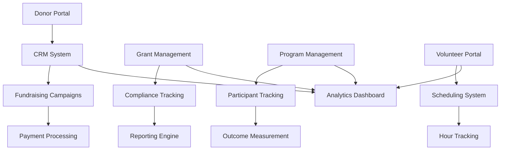

## What is PS Edge?

PS Edge is a comprehensive **nonprofit management platform** designed to empower mission-driven organizations with tools to manage donors, track grants, coordinate programs, engage volunteers, and measure impact. Built specifically for the unique needs of nonprofit organizations of all sizes.

<CardGroup cols={2}>
  <Card
    title="Donor Management"
    icon="hand-holding-heart"
    href="/features/donor-management"
  >
    Complete donor lifecycle management and relationship tracking
  </Card>
  <Card
    title="Grant Tracking"
    icon="file-contract"
    href="/features/grant-tracking"
  >
    End-to-end grant application, tracking, and compliance
  </Card>
  <Card
    title="Program Management"
    icon="calendar-days"
    href="/features/program-management"
  >
    Plan, execute, and measure program effectiveness
  </Card>
  <Card
    title="Volunteer Coordination"
    icon="users"
    href="/features/volunteer-coordination"
  >
    Recruit, schedule, and engage volunteers efficiently
  </Card>
</CardGroup>

## Key Features

<AccordionGroup>
  <Accordion icon="hand-holding-heart" title="Donor Management">
    Comprehensive donor relationship management with detailed profiles, giving history, engagement tracking, and automated communication workflows. Segment donors by giving level, interests, and engagement. Track pledges, recurring gifts, and donor retention metrics.
  </Accordion>

  <Accordion icon="file-contract" title="Grant Tracking">
    Complete grant lifecycle management from prospecting to reporting. Track deadlines, requirements, and milestones. Manage grant applications, awards, and compliance. Generate funder reports and track grant outcomes. Maintain detailed records for audits.
  </Accordion>

  <Accordion icon="calendar-check" title="Program Management">
    Plan, execute, and track programs and services. Manage program budgets, participants, and outcomes. Schedule activities, track attendance, and measure program effectiveness. Link program costs to funding sources for accurate financial tracking.
  </Accordion>

  <Accordion icon="users-gear" title="Volunteer Coordination">
    Recruit, onboard, and manage volunteers with skill tracking and role matching. Schedule volunteer shifts, track hours, and measure volunteer impact. Automated communication for opportunities, reminders, and appreciation. Background check integration and training management.
  </Accordion>

  <Accordion icon="chart-line" title="Impact Measurement">
    Measure and demonstrate your organization's impact with customizable metrics, outcome tracking, and impact storytelling tools. Create compelling impact reports for stakeholders. Track key performance indicators and visualize progress toward mission goals.
  </Accordion>

  <Accordion icon="envelope" title="Communications & Campaigns">
    Integrated email and SMS communication platform for donor appeals, volunteer recruitment, program updates, and newsletters. Create targeted campaigns with segmentation. Track open rates, click-through rates, and campaign effectiveness.
  </Accordion>
</AccordionGroup>

## Platform Architecture

### Organizational Workflow

1. **Donor Engagement**: Attract, cultivate, and steward donor relationships
2. **Grant Acquisition**: Research, apply, and manage grant funding
3. **Program Delivery**: Execute mission-critical programs and services
4. **Volunteer Mobilization**: Engage volunteers to support organizational goals
5. **Impact Reporting**: Measure and communicate organizational impact

## Quick Links

<CardGroup cols={2}>
  <Card
    title="Quickstart"
    icon="rocket"
    href="/docs/quickstart"
  >
    Get started with PS Edge in 5 minutes
  </Card>
  <Card
    title="Architecture"
    icon="sitemap"
    href="/docs/architecture"
  >
    Understand the platform architecture
  </Card>
  <Card
    title="API Reference"
    icon="code"
    href="/api-reference/overview"
  >
    Explore the PS Edge API
  </Card>
  <Card
    title="Impact Measurement"
    icon="chart-bar"
    href="/docs/impact/measurement"
  >
    Learn about impact tracking and reporting
  </Card>
</CardGroup>

## Nonprofit Benefits

<CardGroup cols={2}>
  <Card title="Increase Donations" icon="arrow-trend-up">
    Grow donor retention by 25% with better relationship management
  </Card>
  <Card title="Grant Success" icon="trophy">
    Win more grants with organized tracking and timely submissions
  </Card>
  <Card title="Program Efficiency" icon="gauge-high">
    Serve 40% more program participants with streamlined operations
  </Card>
  <Card title="Volunteer Engagement" icon="heart">
    Double volunteer retention with better coordination and appreciation
  </Card>
</CardGroup>

## Core Capabilities

| Feature | Description |
|---------|-------------|
| **Donor CRM** | 360-degree donor profiles, giving history, engagement scoring |
| **Grant Tracking** | Application management, compliance monitoring, funder reporting |
| **Program Management** | Planning, execution, participant tracking, outcome measurement |
| **Volunteer Coordination** | Recruitment, scheduling, hour tracking, skill matching |
| **Impact Measurement** | Custom metrics, outcome tracking, impact storytelling |
| **Fundraising Campaigns** | Campaign management, peer-to-peer fundraising, event ticketing |
| **Communications** | Email marketing, SMS messaging, donor newsletters |
| **Financial Tracking** | Fund accounting, budget management, expense tracking |
| **Reporting & Analytics** | Custom dashboards, standard reports, data visualization |

## Use Cases

<Check>**Small Nonprofits** - Affordable, all-in-one solution for organizations with limited resources</Check>
<Check>**Mid-Size Organizations** - Scale operations with advanced donor management and grant tracking</Check>
<Check>**Community Foundations** - Manage multiple funds, scholarships, and grantmaking activities</Check>
<Check>**Social Service Agencies** - Coordinate programs, track outcomes, and manage client services</Check>
<Check>**Arts & Cultural Organizations** - Engage patrons, manage memberships, and track events</Check>
<Check>**Environmental Organizations** - Track conservation projects and engage volunteers</Check>

## Compliance & Security

<AccordionGroup>
  <Accordion icon="shield-check" title="Data Security">
    Enterprise-grade security with SOC 2 Type II compliance. End-to-end encryption, regular security audits, and role-based access controls. Your donor data is protected with bank-level security.
  </Accordion>

  <Accordion icon="file-shield" title="Nonprofit Standards">
    Built-in compliance with nonprofit accounting standards (FASB ASC 958), GAAP principles, and grant management best practices. Audit-ready reporting and documentation.
  </Accordion>

  <Accordion icon="user-lock" title="Privacy Protection">
    GDPR and CCPA compliant with donor privacy controls. Configurable consent management, data retention policies, and right-to-be-forgotten workflows.
  </Accordion>
</AccordionGroup>

## Technology Stack

| Component | Technology |
|-----------|-----------|
| **Frontend** | Next.js 15, React 19, TypeScript |
| **Backend** | Node.js, Prisma ORM |
| **Database** | PostgreSQL |
| **Payments** | Stripe, PayPal, Authorize.net integration |
| **Email** | SendGrid, Mailchimp integration |
| **Analytics** | Custom dashboards, data visualization |
| **Security** | OAuth 2.0, 2FA, encryption at rest and in transit |
| **Hosting** | Vercel, secure cloud infrastructure |

## Platform Statistics

| Metric | Capability |
|--------|------------|
| **Donor Records** | Unlimited donors with complete history |
| **Grant Management** | Track unlimited grants and applications |
| **Programs** | Manage unlimited programs and services |
| **Volunteers** | Coordinate unlimited volunteers |
| **Custom Fields** | Fully customizable data model |
| **Integrations** | 50+ third-party integrations |
| **Storage** | Unlimited document storage |

## Next Steps

<Steps>
  <Step title="Read the Quickstart">
    Set up your organization profile and configure PS Edge
  </Step>
  <Step title="Import Your Data">
    Import existing donor, grant, and volunteer data
  </Step>
  <Step title="Configure Donation Processing">
    Set up payment processing for online donations
  </Step>
  <Step title="Create Your First Campaign">
    Launch a fundraising campaign to engage donors
  </Step>
  <Step title="Set Up Programs">
    Add your programs and start tracking participants
  </Step>
  <Step title="Recruit Volunteers">
    Create volunteer opportunities and start scheduling
  </Step>
  <Step title="Measure Impact">
    Configure impact metrics and start tracking outcomes
  </Step>
</Steps>

## Support & Resources

<CardGroup cols={2}>
  <Card title="Documentation" icon="book">
    Comprehensive guides for every feature
  </Card>
  <Card title="Video Tutorials" icon="video">
    Step-by-step video training library
  </Card>
  <Card title="Webinars" icon="presentation-screen">
    Monthly training webinars and office hours
  </Card>
  <Card title="Support Team" icon="headset">
    Dedicated nonprofit support specialists
  </Card>
  <Card title="Community Forum" icon="comments">
    Connect with other nonprofit leaders
  </Card>
  <Card title="Implementation Services" icon="hands-helping">
    Professional onboarding and training
  </Card>
</CardGroup>

## Why Nonprofits Choose PS Edge

<Check>**Purpose-Built** - Designed specifically for nonprofit organizations, not adapted from for-profit CRM</Check>
<Check>**Affordable** - Pricing designed for nonprofit budgets with transparent costs</Check>
<Check>**Easy to Use** - Intuitive interface that doesn't require technical expertise</Check>
<Check>**Comprehensive** - All-in-one platform eliminates need for multiple systems</Check>
<Check>**Scalable** - Grows with your organization from startup to enterprise</Check>
<Check>**Mission-Focused** - Built by people who understand nonprofit challenges</Check>
