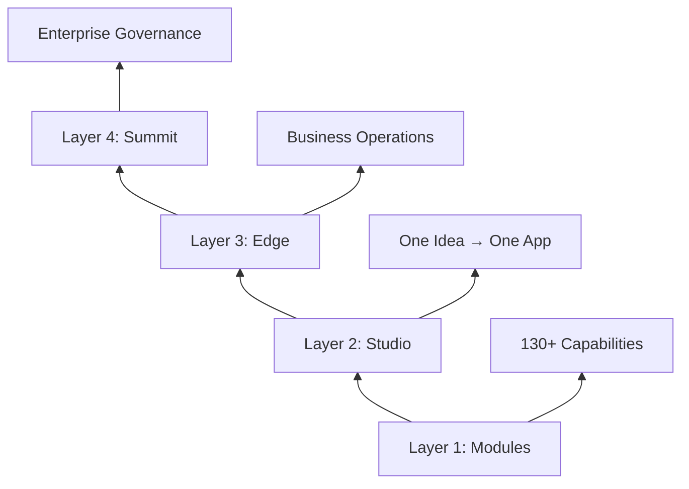

## What is Rally Stack?

Rally Stack is a comprehensive **AI-native platform factory** that enables the rapid creation of business applications through a modular, reusable architecture. Built on modern web technologies with 130+ production-ready modules.

<CardGroup cols={2}>
  <Card
    title="130+ Modules"
    icon="cubes"
    href="/modules/overview"
  >
    Production-ready capability library across 9 categories
  </Card>
  <Card
    title="Rally AI Framework"
    icon="brain"
    href="/docs/platform/rally-ai-framework"
  >
    Multi-model AI orchestration with specialized agents
  </Card>
  <Card
    title="Agent Protocol"
    icon="robot"
    href="/docs/platform/agent-protocol"
  >
    Behavioral OS for AI coordination and collaboration
  </Card>
  <Card
    title="Turborepo Monorepo"
    icon="folder-tree"
    href="/docs/platform/monorepo-structure"
  >
    Efficient workspace management with pnpm
  </Card>
</CardGroup>

## Key Features

<AccordionGroup>
  <Accordion icon="cubes" title="130+ Reusable Modules">
    Production-ready capability library spanning business management, nonprofit operations, sales performance, UI components, and more. Each module follows strict contracts and can be composed into complete applications.
  </Accordion>

  <Accordion icon="layer-group" title="Four-Layer Architecture">
    Clean separation: Modules (capability library) → Studio (one idea → one app) → Edge (business operations) → Summit (enterprise governance). Each layer builds on the previous.
  </Accordion>

  <Accordion icon="brain" title="Rally AI Framework">
    Multi-model AI orchestration coordinating Claude (Anthropic), GPT-4 (OpenAI), and Gemini (Google) through specialized AI Lifecycle Managers (ALMs) for different product tiers.
  </Accordion>

  <Accordion icon="robot" title="Agent Protocol">
    Behavioral OS ensuring consistent AI behavior across Claude Code, ChatGPT, and custom agents. Defines role separation, handoff protocols, and persistent memory.
  </Accordion>

  <Accordion icon="gauge-high" title="Modern Tech Stack">
    Next.js 14-15, React 19, TypeScript 5, Prisma ORM, PostgreSQL, Vercel serverless hosting. Performance-optimized with best practices.
  </Accordion>
</AccordionGroup>

## Four-Layer Architecture



### Value Chain

1. **Modules (Layer 1)**: Reusable capability library - internal building blocks
2. **Studio (Layer 2)**: Turn one idea into one app - focus on UX and value
3. **Edge (Layer 3)**: Add business operations around apps - run the business
4. **Summit (Layer 4)**: Enterprise governance and orchestration - scale operations

## Module Categories (130+)

<CardGroup cols={3}>
  <Card title="Business Management" icon="briefcase">
    Customer success, pipeline, forecasting, commissions
  </Card>
  <Card title="Nonprofit" icon="hand-holding-heart">
    Donor management, grants, programs, volunteers
  </Card>
  <Card title="SPM" icon="chart-line">
    Territory planning, quota management, incentive design
  </Card>
  <Card title="Operations" icon="gears">
    Project management, resource allocation, workflows
  </Card>
  <Card title="Development" icon="code">
    Testing tools, deployment automation, monitoring
  </Card>
  <Card title="UI Components" icon="palette">
    Design system, forms, tables, dashboards
  </Card>
  <Card title="Integrations" icon="plug">
    CRM, finance, email, storage connectors
  </Card>
  <Card title="AI Tools" icon="wand-magic-sparkles">
    AI orchestration, context management, cost tracking
  </Card>
  <Card title="Brand & Content" icon="paintbrush">
    Brand assets, content management, media library
  </Card>
</CardGroup>

## Rally AI Framework

The Rally AI Framework uses specialized **AI Lifecycle Managers (ALMs)** for different product tiers:

| ALM | Purpose | Target Audience | Key Features |
|-----|---------|-----------------|--------------|
| **Creator AI** | Generate Studio apps | Community, youth, creators | 3 steps: Ideate → Create → Validate |
| **Operator AI** | Generate Edge solutions | SMBs (5-50 employees) | 6 P's framework for business ops |
| **Enterprise AI** | Generate Summit platforms | Enterprise organizations | ∞ Extensions for governance |

### AI Model Roles

- **Claude (Anthropic)**: Technical analysis, code generation, architectural decisions
- **GPT-4 (OpenAI)**: Sprint planning, design thinking, business logic
- **Gemini (Google)**: Business validation, testing, quality assurance

## Quick Start

<Steps>
  <Step title="Clone the Repository">
    ```bash
    git clone https://github.com/AICodeRally/rally-stack.git
    cd rally-stack
    ```
  </Step>
  <Step title="Install Dependencies">
    ```bash
    pnpm install
    ```
  </Step>
  <Step title="Set Up Environment">
    ```bash
    cp .env.example .env.local
    # Add your database and API keys
    ```
  </Step>
  <Step title="Run Development Server">
    ```bash
    pnpm dev
    ```
  </Step>
</Steps>

## Technology Stack

| Category | Technology | Purpose |
|----------|-----------|---------|
| **Frontend** | Next.js 15, React 19 | Server-side rendering, routing |
| **Language** | TypeScript 5 | Type safety, developer experience |
| **Database** | Prisma + PostgreSQL | ORM and data persistence |
| **Styling** | Tailwind CSS | Utility-first styling |
| **Monorepo** | Turborepo + pnpm | Workspace management |
| **Hosting** | Vercel | Serverless deployment |
| **AI** | Claude, GPT-4, Gemini | Multi-model orchestration |

## Use Cases

<CardGroup cols={2}>
  <Card title="Build SaaS Applications" icon="rocket">
    Use 130+ modules to rapidly build industry-specific SaaS products
  </Card>
  <Card title="Create Vertical Solutions" icon="building">
    Leverage proven modules for nonprofit, SPM, or industry workflows
  </Card>
  <Card title="Accelerate MVP Development" icon="gauge-high">
    Go from idea to working prototype in days, not months
  </Card>
  <Card title="Scale with AI" icon="arrow-up-right-dots">
    Integrate AI orchestration for intelligent features
  </Card>
</CardGroup>

## Next Steps

<CardGroup cols={2}>
  <Card
    title="Quickstart Guide"
    icon="bolt"
    href="/docs/quickstart"
  >
    Get Rally Stack running locally in 5 minutes
  </Card>
  <Card
    title="Module Library"
    icon="cubes"
    href="/modules/overview"
  >
    Explore the 130+ available modules
  </Card>
  <Card
    title="Architecture Deep Dive"
    icon="sitemap"
    href="/docs/architecture"
  >
    Understand the four-layer system
  </Card>
  <Card
    title="API Reference"
    icon="code"
    href="/api-reference/overview"
  >
    Explore the Rally Stack API
  </Card>
</CardGroup>
