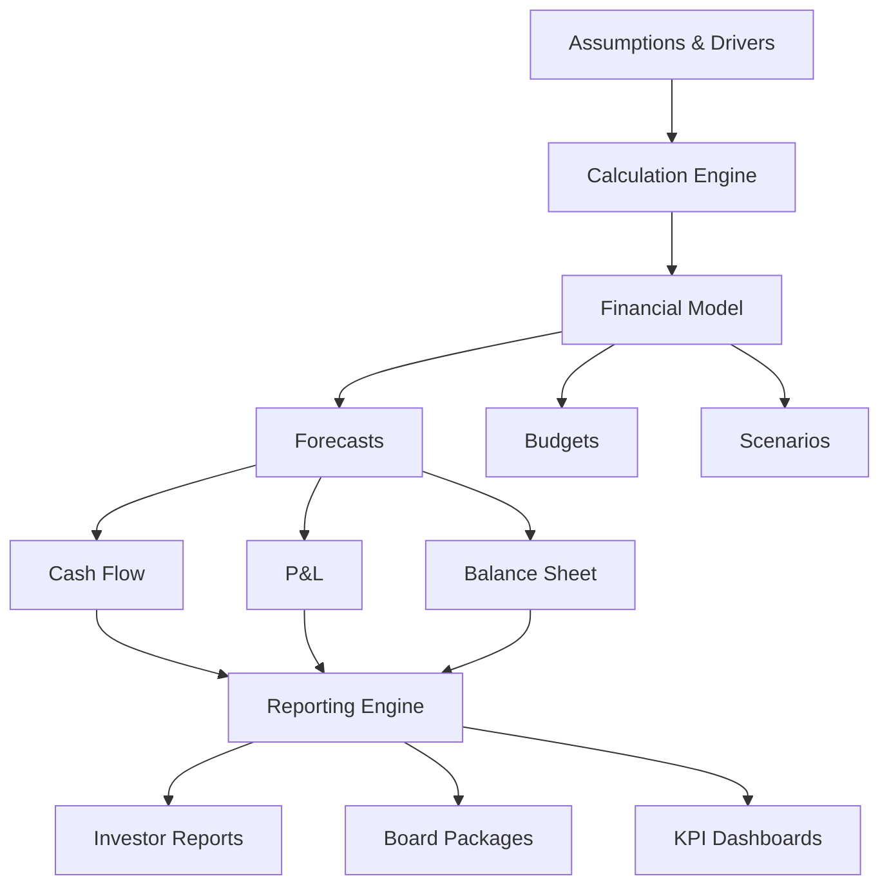

## What is SFP?

SFP (Startup Financial Planning) is a comprehensive **financial planning and forecasting platform** designed specifically for startups and high-growth companies. With deterministic calculation engines, scenario modeling capabilities, and sophisticated forecasting tools, SFP empowers founders and finance teams to make data-driven financial decisions.

<CardGroup cols={2}>
  <Card
    title="Scenario Modeling"
    icon="sliders"
    href="/features/scenario-modeling"
  >
    Create and compare multiple financial scenarios with ease
  </Card>
  <Card
    title="Deterministic Calculations"
    icon="calculator"
    href="/features/deterministic-calculations"
  >
    Precise, reproducible financial calculations every time
  </Card>
  <Card
    title="Forecast Generation"
    icon="chart-line"
    href="/features/forecast-generation"
  >
    Generate accurate revenue, expense, and cash flow forecasts
  </Card>
  <Card
    title="Budget Planning"
    icon="file-invoice-dollar"
    href="/features/budget-planning"
  >
    Create, track, and adjust budgets with variance analysis
  </Card>
</CardGroup>

## Key Features

<AccordionGroup>
  <Accordion icon="sliders" title="Scenario Modeling">
    Create multiple financial scenarios to model different business outcomes. Compare best-case, worst-case, and most-likely scenarios side by side. Test assumptions and understand the financial impact of strategic decisions before committing resources.
  </Accordion>

  <Accordion icon="calculator" title="Deterministic Calculations">
    Built on a deterministic calculation engine that ensures the same inputs always produce the same outputs. All formulas are transparent, auditable, and version-controlled. No black boxes or hidden calculations - full visibility into every number.
  </Accordion>

  <Accordion icon="chart-line" title="Forecast Generation">
    Generate comprehensive financial forecasts including revenue projections, expense forecasts, cash flow statements, and runway calculations. Use historical data, growth assumptions, and market trends to create accurate forward-looking financials.
  </Accordion>

  <Accordion icon="file-invoice-dollar" title="Budget Planning">
    Create annual budgets with monthly or quarterly breakdowns. Track actual spending against budget in real-time. Variance analysis highlights areas where you're over or under budget. Adjust budgets as your business evolves.
  </Accordion>

  <Accordion icon="file-chart-line" title="Financial Reporting">
    Generate investor-ready financial reports including income statements, balance sheets, cash flow statements, and custom KPI dashboards. Export to Excel or PDF. Automated monthly board package generation.
  </Accordion>

  <Accordion icon="sitemap" title="Driver-Based Planning">
    Build financial models based on business drivers (customers, revenue per customer, headcount, etc.) rather than just line items. Understand how changes in key metrics flow through your entire financial model.
  </Accordion>
</AccordionGroup>

## Platform Architecture

### Financial Planning Workflow

1. **Model Setup**: Define business drivers, assumptions, and calculation logic
2. **Scenario Creation**: Build multiple scenarios for different outcomes
3. **Forecast Generation**: Generate forward-looking financial statements
4. **Budget Creation**: Set annual budgets based on forecasts
5. **Tracking**: Monitor actuals vs. forecast and budget
6. **Reporting**: Generate investor and board reports
7. **Analysis**: Analyze variances and adjust plans accordingly

## Quick Links

<CardGroup cols={2}>
  <Card
    title="Quickstart"
    icon="rocket"
    href="/docs/quickstart"
  >
    Get started with SFP in 5 minutes
  </Card>
  <Card
    title="Architecture"
    icon="sitemap"
    href="/docs/architecture"
  >
    Understand the platform architecture
  </Card>
  <Card
    title="API Reference"
    icon="code"
    href="/api-reference/overview"
  >
    Explore the SFP API
  </Card>
  <Card
    title="Financial Modeling"
    icon="calculator"
    href="/docs/modeling/overview"
  >
    Learn about building financial models
  </Card>
</CardGroup>

## Startup Benefits

<CardGroup cols={2}>
  <Card title="Fundraise with Confidence" icon="handshake">
    Impress investors with sophisticated financial models and projections
  </Card>
  <Card title="Extend Runway" icon="clock">
    Optimize spending and cash flow to maximize runway
  </Card>
  <Card title="Make Better Decisions" icon="lightbulb">
    Model decisions before you make them to understand financial impact
  </Card>
  <Card title="Save Time" icon="gauge-high">
    Automate financial planning and spend less time in spreadsheets
  </Card>
</CardGroup>

## Core Capabilities

| Feature | Description |
|---------|-------------|
| **Scenario Modeling** | Create unlimited scenarios with independent assumptions |
| **Deterministic Engine** | Transparent, reproducible calculations with version control |
| **Revenue Forecasting** | Model multiple revenue streams with growth assumptions |
| **Expense Planning** | Detailed expense categories with headcount planning |
| **Cash Flow Forecasting** | 13-week and monthly cash flow projections |
| **Runway Calculation** | Real-time runway based on cash position and burn rate |
| **Budget Management** | Annual budgets with variance analysis and adjustments |
| **KPI Tracking** | Custom metrics and dashboards for key performance indicators |
| **Financial Statements** | Auto-generated P&L, balance sheet, and cash flow statements |
| **Investor Reporting** | Templates for board packages and investor updates |

## Use Cases

<Check>**Seed Stage Startups** - Model your way from MVP to product-market fit</Check>
<Check>**Series A/B Companies** - Plan for growth with sophisticated forecasts</Check>
<Check>**SaaS Businesses** - Model MRR growth, churn, and unit economics</Check>
<Check>**E-commerce Companies** - Forecast inventory, COGS, and customer acquisition</Check>
<Check>**Marketplace Platforms** - Model two-sided marketplace dynamics</Check>
<Check>**Hardware Startups** - Plan manufacturing costs and inventory cycles</Check>

## Deterministic Calculation Engine

<AccordionGroup>
  <Accordion icon="check-double" title="What is Deterministic?">
    Deterministic means predictable and reproducible. Given the same inputs, the system always produces the same outputs. No randomness, no approximations, no black boxes. Every calculation is transparent and auditable.
  </Accordion>

  <Accordion icon="code" title="Formula Transparency">
    Every number in SFP can be traced back to its source. Click any cell to see the formula, assumptions, and dependencies. Full audit trail of changes with version history. Export formulas for external review.
  </Accordion>

  <Accordion icon="clock-rotate-left" title="Version Control">
    All changes to models, assumptions, and formulas are tracked with version control. Roll back to any previous version. Compare versions to understand what changed. Perfect for board presentations and investor diligence.
  </Accordion>

  <Accordion icon="shield-check" title="Validation & Testing">
    Built-in validation rules ensure data integrity. Automated testing catches errors before they impact your forecasts. Warning system alerts you to unusual values or potential issues.
  </Accordion>
</AccordionGroup>

## Technology Stack

| Component | Technology |
|-----------|-----------|
| **Frontend** | Next.js 15, React 19, TypeScript |
| **Backend** | Node.js, Prisma ORM |
| **Database** | PostgreSQL with time-series optimization |
| **Calculation Engine** | Custom deterministic engine with formula parsing |
| **Charting** | Recharts, data visualization libraries |
| **Export** | Excel, PDF, CSV export capabilities |
| **Integrations** | QuickBooks, Xero, Stripe, banking APIs |
| **Hosting** | Vercel with edge functions for performance |

## Financial Metrics Tracked

| Category | Metrics |
|----------|---------|
| **Revenue** | MRR, ARR, growth rate, churn, expansion revenue |
| **Profitability** | Gross margin, EBITDA, net profit, burn rate |
| **Cash** | Cash balance, runway, burn multiple, cash conversion |
| **Unit Economics** | CAC, LTV, LTV:CAC ratio, payback period |
| **Operations** | Headcount, revenue per employee, magic number |
| **Growth** | YoY growth, QoQ growth, CAGR, rule of 40 |

## Next Steps

<Steps>
  <Step title="Read the Quickstart">
    Set up your company profile and connect data sources
  </Step>
  <Step title="Define Business Drivers">
    Identify the key metrics that drive your business
  </Step>
  <Step title="Build Your Financial Model">
    Create your first model with revenue and expense assumptions
  </Step>
  <Step title="Create Scenarios">
    Model best-case, worst-case, and most-likely scenarios
  </Step>
  <Step title="Generate Forecasts">
    Create 12-24 month financial forecasts
  </Step>
  <Step title="Set Up Budgets">
    Create annual budget and department budgets
  </Step>
  <Step title="Track Actuals">
    Connect accounting system to track actual vs. forecast
  </Step>
  <Step title="Generate Reports">
    Create your first board package or investor update
  </Step>
</Steps>

## Support & Resources

<CardGroup cols={2}>
  <Card title="Documentation" icon="book">
    Comprehensive guides for financial planning
  </Card>
  <Card title="Video Tutorials" icon="video">
    Step-by-step modeling tutorials
  </Card>
  <Card title="Templates" icon="file-lines">
    Pre-built models for SaaS, marketplace, e-commerce
  </Card>
  <Card title="Financial Advisors" icon="user-tie">
    Access to financial planning experts
  </Card>
  <Card title="Community Forum" icon="comments">
    Connect with other founders and finance professionals
  </Card>
  <Card title="Office Hours" icon="calendar">
    Weekly office hours with financial planning experts
  </Card>
</CardGroup>

## Why Startups Choose SFP

<Check>**Built for Startups** - Designed specifically for high-growth companies, not adapted from enterprise FP&A</Check>
<Check>**Transparent Calculations** - No black boxes - see exactly how every number is calculated</Check>
<Check>**Scenario Planning** - Model multiple futures to understand risk and opportunity</Check>
<Check>**Investor-Ready** - Generate reports that impress investors and board members</Check>
<Check>**Time Savings** - Automate financial planning and spend less time in spreadsheets</Check>
<Check>**Scalable** - Grows from seed stage to Series C and beyond</Check>

## Platform Differentiators

<CardGroup cols={3}>
  <Card title="Deterministic Engine" icon="gears">
    Reproducible calculations with full transparency
  </Card>
  <Card title="Scenario Modeling" icon="chart-gantt">
    Compare unlimited scenarios side by side
  </Card>
  <Card title="Driver-Based" icon="gauge">
    Model based on business drivers, not just line items
  </Card>
  <Card title="Real-Time Updates" icon="rotate">
    Live data connections for up-to-date actuals
  </Card>
  <Card title="Collaboration" icon="users">
    Team collaboration with permissions and workflows
  </Card>
  <Card title="Audit Trail" icon="list-check">
    Complete version history and change tracking
  </Card>
</CardGroup>
