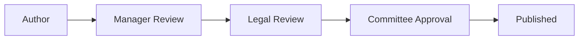

# Workflow Configuration

This guide covers configuring approval workflows, SLA settings, and committee routing in SGM.

## Approval Workflows

SGM supports multi-step approval workflows for:
- Documents
- Plans
- Exceptions
- Policy changes

## Committees

### Default Committees

SGM includes two governance committees:

| Committee | Acronym | Purpose |
|-----------|---------|---------|
| Sales Governance Compliance Committee | SGCC | Policy and compliance decisions |
| Compensation Review Board | CRB | Individual case decisions |

### SGCC Configuration

| Setting | Default | Description |
|---------|---------|-------------|
| **Members** | 7 | Committee size |
| **Quorum** | 4 | Minimum for decisions |
| **Meeting Frequency** | Monthly | Regular meeting schedule |
| **Chair** | Configurable | Decision tie-breaker |

### CRB Configuration

| Setting | Default | Description |
|---------|---------|-------------|
| **Members** | 5 | Committee size |
| **Quorum** | 3 | Minimum for decisions |
| **Meeting Frequency** | Bi-weekly | Regular meeting schedule |
| **Chair** | Configurable | Decision tie-breaker |

### Managing Committee Members

<Steps>
  <Step title="Navigate to Committees">
    Go to Oversee Mode → Committees
  </Step>
  <Step title="Select committee">
    Click SGCC or CRB
  </Step>
  <Step title="Manage members">
    Add or remove members as needed
  </Step>
  <Step title="Assign roles">
    Designate Chair and Vice Chair
  </Step>
</Steps>

## Workflow Routing

### Automatic Routing

Items are automatically routed based on:

| Criteria | Routes To |
|----------|-----------|
| Policy changes | SGCC |
| Document approvals | SGCC |
| Individual exceptions | CRB |
| Windfall deals | CRB |
| Plan modifications | SGCC → CRB |

### Routing Rules

Configure routing rules at Settings → Workflows → Routing:

```yaml
rules:
  - name: "Policy Approval"
    trigger:
      type: "policy"
      status: "pending_approval"
    route_to: "sgcc"

  - name: "Exception Request"
    trigger:
      type: "case"
      case_type: "exception"
    route_to: "crb"

  - name: "High Value Deal"
    trigger:
      type: "case"
      financial_impact: "> 100000"
    route_to: "crb"
    escalate_to: "sgcc"
```

## SLA Configuration

### Default SLAs

| Committee | Priority | Target SLA |
|-----------|----------|------------|
| SGCC | Urgent | 1 day |
| SGCC | High | 3 days |
| SGCC | Medium | 5 days |
| SGCC | Low | 10 days |
| CRB | Urgent | Same day |
| CRB | High | 2 days |
| CRB | Medium | 3 days |
| CRB | Low | 5 days |

### Modifying SLAs

Configure at Settings → Workflows → SLAs:

```yaml
slas:
  sgcc:
    urgent: 1
    high: 3
    medium: 5
    low: 10
  crb:
    urgent: 0  # Same day
    high: 2
    medium: 3
    low: 5
```

### SLA Warnings

Configure warning thresholds:

| Setting | Default | Description |
|---------|---------|-------------|
| **Warning threshold** | 50% | Show warning at this % of SLA |
| **Escalation threshold** | 80% | Auto-escalate at this % |
| **Overdue notification** | 100% | Notify at SLA breach |

## Escalation Rules

### Automatic Escalation

Configure auto-escalation at Settings → Workflows → Escalation:

```yaml
escalation:
  - name: "SLA Warning"
    trigger: "sla_percent >= 80"
    action: "notify_manager"

  - name: "SLA Breach"
    trigger: "sla_percent >= 100"
    action: "escalate_to_chair"

  - name: "High Value Automatic"
    trigger: "financial_impact >= 250000"
    action: "add_finance_review"
```

### Manual Escalation

Users can manually escalate items when:
- Case requires committee input
- Decision exceeds their authority
- Complex situation needs broader review

## Multi-Step Workflows

### Standard Document Approval



### Configuring Steps

At Settings → Workflows → Steps:

```yaml
document_approval:
  steps:
    - name: "Manager Review"
      role: "MANAGER"
      required: true

    - name: "Legal Review"
      role: "LEGAL"
      required:
        condition: "document_type == 'policy'"

    - name: "Committee Approval"
      committee: "sgcc"
      required: true
```

### Conditional Steps

Add steps based on conditions:

| Condition | Example |
|-----------|---------|
| Document type | Legal review for policies |
| Financial value | Finance review for high-value items |
| Jurisdiction | State-specific reviews |
| Department | Department head approval |

## Notification Configuration

### Email Notifications

Configure at Settings → Notifications:

| Event | Recipients | Default |
|-------|------------|---------|
| Item assigned | Assignee | ✅ On |
| SLA warning | Assignee, Manager | ✅ On |
| SLA breach | Assignee, Manager, Chair | ✅ On |
| Decision made | Submitter | ✅ On |
| Comment added | Watchers | ⬜ Off |

### Notification Templates

Customize email templates:

```handlebars
Subject: [{{priority}}] Approval Required: {{item.title}}

Hello {{assignee.name}},

A new {{item.type}} requires your review:

**{{item.title}}**
Submitted by: {{submitter.name}}
Priority: {{priority}}
SLA: {{sla.deadline}}

[Review Now]({{item.url}})
```

## Calendar Integration

### Meeting Scheduling

Configure committee meeting schedules:

```yaml
meetings:
  sgcc:
    frequency: "monthly"
    day: "first_tuesday"
    time: "14:00"
    duration: "2h"

  crb:
    frequency: "biweekly"
    day: "thursday"
    time: "10:00"
    duration: "1h"
```

### Agenda Generation

Items pending for more than X days automatically appear on meeting agendas.

Configure at Settings → Workflows → Calendar:

| Setting | Default | Description |
|---------|---------|-------------|
| **Agenda threshold** | 3 days | Days pending before agenda |
| **Auto-generate** | ✅ On | Create agenda automatically |
| **Send reminder** | 24 hours | Pre-meeting reminder |

## Delegation

### Out-of-Office Delegation

Users can delegate approvals when unavailable:

<Steps>
  <Step title="Open Settings">
    Go to Settings → Profile → Delegation
  </Step>
  <Step title="Set delegate">
    Choose a delegate with appropriate role
  </Step>
  <Step title="Set dates">
    Specify delegation period
  </Step>
  <Step title="Save">
    Delegation becomes active
  </Step>
</Steps>

### Permanent Delegation

For ongoing delegation:
1. Create delegation rule
2. Specify item types to delegate
3. Set delegate user
4. No end date

## Audit Trail

All workflow actions are logged:

- Who took action
- What action was taken
- When it occurred
- Routing decisions
- SLA calculations

View at Oversee Mode → Audit.

## Troubleshooting

<AccordionGroup>
  <Accordion title="Item not routing correctly">
    - Check routing rules
    - Verify item type and attributes
    - Review rule priority/order
  </Accordion>
  <Accordion title="SLA not calculating">
    - Verify SLA configuration
    - Check business hours settings
    - Confirm priority is set
  </Accordion>
  <Accordion title="Notifications not sending">
    - Check notification settings
    - Verify email configuration
    - Review user notification preferences
  </Accordion>
</AccordionGroup>

## Related

<CardGroup cols={2}>
  <Card title="Approvals" icon="clipboard-check" href="/user-guide/approvals">
    Using the approval queue
  </Card>
  <Card title="Oversee Mode" icon="eye" href="/user-guide/modes/oversee-mode">
    Committee management
  </Card>
</CardGroup>
