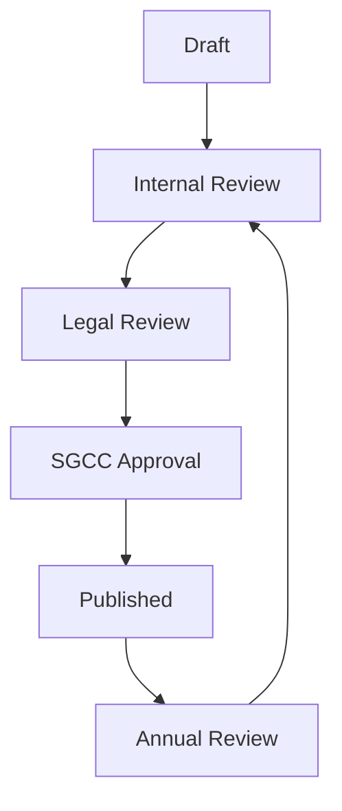
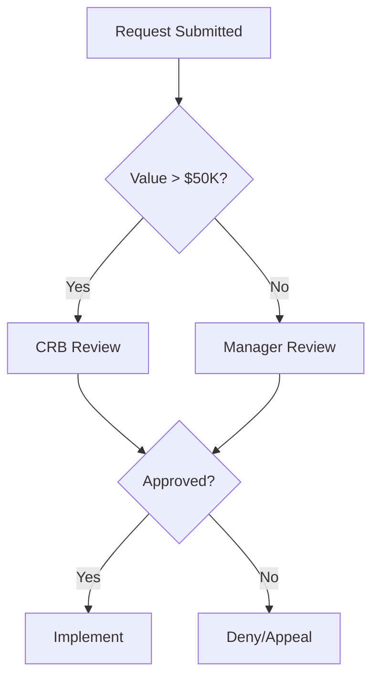
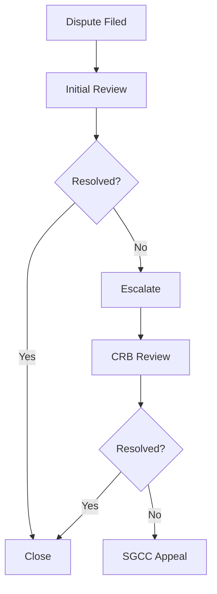

# Governance Framework Reference

SGM uses a structured governance framework to organize policies, controls, and oversight mechanisms. This reference documents the framework structure.

## Framework Overview

The governance framework consists of:

- **6 Governance Pillars**: High-level governance categories
- **17 SCP Policies**: Detailed policy documents
- **2 Committees**: SGCC and CRB for governance decisions
- **55+ Requirements**: Specific compliance checkpoints

## Governance Pillars

| Pillar | Description | Policies |
|--------|-------------|----------|
| **Financial Governance** | Commission payments, clawbacks, draws | SCP-001, SCP-008, SCP-011 |
| **Legal & Compliance** | Regulatory requirements, state laws | SCP-005, SCP-006, SCP-017 |
| **People & HR** | Employee lifecycle, leave, termination | SCP-009, SCP-012, SCP-016 |
| **Performance & Territory** | Quotas, crediting, territories | SCP-002, SCP-007, SCP-014 |
| **Deals & Incentives** | Large deals, SPIFs, windfalls | SCP-003, SCP-004 |
| **Operations & Systems** | Plan changes, data, disputes | SCP-010, SCP-013, SCP-015 |

## Governance Committees

### Sales Governance Compliance Committee (SGCC)

The SGCC is the primary governance body for policy and compliance matters.

| Attribute | Value |
|-----------|-------|
| **Size** | 7 members |
| **Quorum** | 4 members |
| **Meeting Frequency** | Monthly |
| **Chair** | VP Sales Operations |

**Responsibilities**:
- Policy creation and updates
- Compliance standards
- Major exception requests
- Framework changes
- Audit oversight

**Typical Members**:
- VP Sales Operations (Chair)
- VP Finance
- VP Legal
- VP HR
- Director of Sales Compensation
- Director of Revenue Operations
- Sales Leadership Representative

### Compensation Review Board (CRB)

The CRB handles individual cases and exception decisions.

| Attribute | Value |
|-----------|-------|
| **Size** | 5 members |
| **Quorum** | 3 members |
| **Meeting Frequency** | Bi-weekly |
| **Chair** | Director of Sales Compensation |

**Responsibilities**:
- Windfall deal approvals
- Special exceptions
- Individual case decisions
- Policy recommendations to SGCC

**Typical Members**:
- Director of Sales Compensation (Chair)
- Sales Operations Manager
- Finance Representative
- Legal Representative
- Regional Sales Leader (rotating)

## Governance Matrix

The governance matrix maps policies to approval authorities:

### Policy Approval Authority

| Policy Type | Initial Approval | Changes | Exceptions |
|-------------|------------------|---------|------------|
| Financial Controls | SGCC | SGCC | CRB |
| Legal Compliance | SGCC + Legal | SGCC + Legal | Not allowed |
| HR Policies | SGCC + HR | SGCC + HR | CRB |
| Performance Mgmt | SGCC | CRB | CRB |
| Deal Governance | SGCC | SGCC | CRB |
| Plan Admin | SGCC | CRB | CRB |
| IT Governance | SGCC + IT | SGCC + IT | CRB |
| Governance | SGCC | SGCC | Not allowed |

### Decision Authority by Value

| Value Threshold | Authority |
|-----------------|-----------|
| < $10,000 | Manager |
| $10,000 - $50,000 | Director |
| $50,000 - $100,000 | VP |
| $100,000 - $250,000 | CRB |
| > $250,000 | SGCC |

## Compliance Requirements

### Financial Requirements

| Requirement | Policy | Severity |
|-------------|--------|----------|
| Clawback period defined | SCP-001 | Critical |
| Draw recovery terms | SCP-008 | High |
| Payment schedule documented | SCP-011 | High |
| Cap provisions included | SCP-003 | Medium |

### Legal Requirements

| Requirement | Policy | Severity |
|-------------|--------|----------|
| 409A compliance language | SCP-005 | Critical |
| State wage law reference | SCP-006 | Critical |
| International provisions | SCP-017 | High |
| At-will statement | SCP-012 | High |

### HR Requirements

| Requirement | Policy | Severity |
|-------------|--------|----------|
| Leave treatment defined | SCP-009 | High |
| Termination provisions | SCP-012 | Critical |
| Onboarding schedule | SCP-016 | Medium |
| FMLA compliance | SCP-009 | Critical |

### Operational Requirements

| Requirement | Policy | Severity |
|-------------|--------|----------|
| Quota methodology | SCP-002 | High |
| Crediting rules | SCP-007 | High |
| Territory definitions | SCP-014 | Medium |
| Exception process | SCP-015 | High |

## Framework Workflows

### Policy Lifecycle



### Exception Workflow



### Dispute Resolution



## Compliance Scoring

### Coverage Score Calculation

```
Coverage Score = (Covered Requirements / Total Requirements) × 100
```

### Risk Weighting

| Severity | Weight |
|----------|--------|
| Critical | 3.0 |
| High | 2.0 |
| Medium | 1.0 |
| Low | 0.5 |

### Compliance Score

```
Compliance Score = Σ(Covered × Weight) / Σ(Total × Weight) × 100
```

## Framework Integration

### With Gap Analysis

Gap analysis checks documents against framework requirements:
- Each requirement has a detection pattern
- Gaps are categorized by pillar and severity
- Remediation recommendations include policy references

### With Plans

Plan templates incorporate framework requirements:
- Sections mapped to policies
- Compliance validation before approval
- Version control with policy references

### With Audit

Audit trail tracks framework compliance:
- Policy decisions logged
- Committee approvals recorded
- Exception history maintained

## Best Practices

<AccordionGroup>
  <Accordion title="Annual review cycle">
    Review all policies annually. Update for regulatory changes, organizational changes, and lessons learned from exceptions and disputes.
  </Accordion>
  <Accordion title="Committee documentation">
    Document all committee decisions with rationale. Maintain meeting minutes and voting records for audit purposes.
  </Accordion>
  <Accordion title="Exception tracking">
    Track exception patterns to identify policy gaps or unclear language. Use exception data to inform policy updates.
  </Accordion>
</AccordionGroup>

## Related

<CardGroup cols={2}>
  <Card title="Policy Library" icon="book" href="/reference/policy-library">
    Detailed policy reference
  </Card>
  <Card title="Oversee Mode" icon="eye" href="/user-guide/modes/oversee-mode">
    Committee management
  </Card>
</CardGroup>
