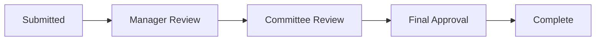

# Approvals

The Approvals feature manages governance approval workflows for documents, plans, and exceptions. Two committees handle approvals: SGCC (Sales Governance Compliance Committee) for policy matters and CRB (Compensation Review Board) for individual decisions.

## Accessing Approvals

**Path:** `/approvals`

Navigate via: Operate Mode → Approvals, or directly to `/approvals`

## Understanding the Queue

The approval queue shows all items pending review:

### Queue Columns

| Column | Description |
|--------|-------------|
| **Item** | Name and type of approval |
| **Type** | Document, Plan, Exception, or Policy |
| **Committee** | SGCC or CRB |
| **Priority** | Urgent, High, Medium, Low |
| **SLA Status** | Time remaining indicator |
| **Submitted** | When the item was submitted |
| **Submitter** | Who submitted for approval |

### Filtering the Queue

Filter by:
- **Status**: Pending, In Review, Escalated
- **Committee**: SGCC, CRB, or All
- **Priority**: Urgent, High, Medium, Low
- **Type**: Document, Plan, Exception, Policy
- **Data Type**: Demo, Template, Client

### Data Types

Approval items display badges:
- **Demo** (orange): Sample approvals for training
- **Template** (teal): Template-based workflows
- **Client** (green): Production approvals requiring action

## SLA Tracking

Each approval has a target SLA based on committee and priority:

### SGCC SLAs

| Priority | Target | Warning | Overdue |
|----------|--------|---------|---------|
| **Urgent** | 1 day | 4 hours remaining | Past due |
| **High** | 3 days | 1 day remaining | Past due |
| **Medium** | 5 days | 2 days remaining | Past due |
| **Low** | 10 days | 3 days remaining | Past due |

### CRB SLAs

| Priority | Target | Warning | Overdue |
|----------|--------|---------|---------|
| **Urgent** | Same day | 2 hours remaining | Past due |
| **High** | 2 days | 4 hours remaining | Past due |
| **Medium** | 3 days | 1 day remaining | Past due |
| **Low** | 5 days | 2 days remaining | Past due |

### SLA Indicators

| Color | Meaning |
|-------|---------|
| 🟢 Green | On track, plenty of time |
| 🟡 Yellow | Approaching deadline |
| 🔴 Red | Overdue or at risk |

## Processing an Approval

<Steps>
  <Step title="Select item from queue">
    Click an approval item to view details
  </Step>
  <Step title="Review context">
    Read the item description, attached documents, and policy references
  </Step>
  <Step title="Check history">
    See previous actions and comments on this item
  </Step>
  <Step title="Make decision">
    Choose to Approve, Request Changes, or Reject
  </Step>
  <Step title="Add rationale">
    Document your decision reasoning
  </Step>
</Steps>

## Approval Actions

| Action | When to Use | Result |
|--------|-------------|--------|
| **Approve** | Item meets all requirements | Moves to next step or completes |
| **Request Changes** | Need modifications before approval | Returns to submitter |
| **Reject** | Does not meet requirements | Workflow ends |
| **Escalate** | Needs higher authority | Routes to committee lead |
| **Reassign** | Better handled by someone else | Changes approver |

## Approval Detail View

When you select an approval item:

### Header Section
- Item name and ID
- Type badge
- Committee assignment
- Priority indicator
- SLA countdown

### Context Section
- Full description
- Business justification
- Impact assessment
- Related policies

### Documents Section
- Attached files
- Links to related documents
- Version information

### History Section
- Timeline of all actions
- Comments from reviewers
- Status changes
- Timestamps

### Actions Section
- Decision buttons
- Comment field
- Attachment upload

## Multi-Step Approvals

Some items require multiple approval steps:

The approval detail shows:
- Current step highlighted
- Completed steps with approver names
- Pending steps
- Overall progress

## Bulk Operations

For efficiency, you can process multiple approvals:

1. Select multiple items using checkboxes
2. Choose bulk action (Approve, Reassign)
3. Add common rationale
4. Confirm action

<Warning>
Bulk approval is only available for items of the same type with similar risk level.
</Warning>

## Governance Committees

### SGCC (Sales Governance Compliance Committee)

**Responsibilities:**
- Policy creation and updates
- Compliance standards
- Major exception requests
- Framework changes

**Membership:**
- 7 members
- Monthly meetings
- Quorum: 4 members

### CRB (Compensation Review Board)

**Responsibilities:**
- Windfall deal approvals
- Special exceptions
- Individual case decisions
- Policy recommendations

**Membership:**
- 5 members
- Bi-weekly meetings

## Approval Notifications

You receive notifications for:
- New items assigned to you
- Items approaching SLA deadline
- Changes to items you submitted
- Decisions on items you're watching

Configure notification preferences in Settings → Notifications.

## Audit Trail

All approval actions are logged:
- Who took action
- What decision was made
- When it occurred
- Rationale provided
- Documents attached

View the full audit trail in the History section of any approval item.

## Related Features

<CardGroup cols={2}>
  <Card title="Documents" icon="file" href="/user-guide/documents">
    View approved documents
  </Card>
  <Card title="Plan Management" icon="clipboard-list" href="/user-guide/plan-management">
    Track plan approvals
  </Card>
  <Card title="Dispute Mode" icon="scale-balanced" href="/user-guide/modes/dispute-mode">
    Handle escalated cases
  </Card>
  <Card title="Oversee Mode" icon="eye" href="/user-guide/modes/oversee-mode">
    Committee management
  </Card>
</CardGroup>
