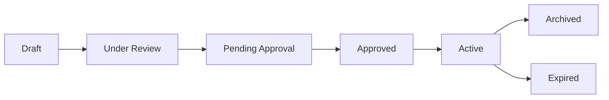

# Documents

The Documents feature is the central library for all governance documents. It supports version control, lifecycle management, and full-text search across frameworks, policies, procedures, templates, and guides.

## Accessing Documents

**Path:** `/documents`

Navigate via: Operate Mode → Documents, or directly to `/documents`

## Document Types

SGM organizes documents into these types:

| Type | Description | Examples |
|------|-------------|----------|
| **Framework** | High-level governance structures | Compensation governance framework |
| **Policy** | Formal policy documents | Commission policy, clawback policy |
| **Procedure** | Step-by-step processes | Approval procedures, onboarding process |
| **Template** | Reusable document templates | Plan template, exception request form |
| **Checklist** | Compliance and review checklists | Audit checklist, review checklist |
| **Guide** | How-to documentation | User guides, reference materials |

## Document Lifecycle

Documents progress through these stages:

| Status | Description | Editable |
|--------|-------------|----------|
| **Draft** | Work in progress | Yes |
| **Under Review** | Stakeholder review | Comments only |
| **Pending Approval** | In approval workflow | No |
| **Approved** | Passed approval | No |
| **Active** | Currently in effect | Requires workflow |
| **Archived** | No longer in use | No |
| **Expired** | Past expiration date | No |

## Browsing Documents

### Document List

The list shows:
- Document code and title
- Type badge
- Status indicator
- Version number
- Owner
- Last updated
- Data type badge

### Filtering

Filter documents by:
- **Type**: Framework, Policy, Procedure, Template, Checklist, Guide
- **Status**: Draft, Under Review, Approved, Active, Archived, Expired
- **Data Type**: Demo, Template, Client
- **Search**: Code, title, or content

### Data Types

Documents display badges:
- **Demo** (orange): Sample documents for training
- **Template** (teal): Standard templates for reuse
- **Client** (green): Production client documents

## Document Detail View

Click any document to see full details:

### Header
- Document code and title
- Type and status badges
- Version number
- Owner and dates

### Content
- Full document text
- Formatted sections
- Tables and lists
- Embedded references

### Metadata
- Created date
- Last modified
- Expiration date
- Related documents
- Policy references

### Actions
- Edit (if permitted)
- Download
- Share link
- View history
- Submit for approval

## Creating a Document

<Steps>
  <Step title="Click New Document">
    Use the + button in the documents toolbar
  </Step>
  <Step title="Select document type">
    Choose Framework, Policy, Procedure, etc.
  </Step>
  <Step title="Choose template">
    Start from a template or blank
  </Step>
  <Step title="Fill in details">
    - Document code and title
    - Content sections
    - Metadata
  </Step>
  <Step title="Add relationships">
    Link to related documents and policies
  </Step>
  <Step title="Save draft">
    Save to continue editing
  </Step>
</Steps>

## Editing Documents

### Rich Text Editor

The document editor supports:
- Headings and paragraphs
- Bold, italic, underline
- Bulleted and numbered lists
- Tables
- Links
- Code blocks

### Policy References

Link to policies inline:
1. Select text
2. Click "Add Policy Reference"
3. Search for the policy
4. Insert reference

Policy references appear as clickable links in the document.

### Variables

Use variables for reusable content:
- `{{company_name}}` - Organization name
- `{{effective_date}}` - Document effective date
- `{{version}}` - Current version number

## Version Control

SGM tracks all document changes:

### Version History

- Each save creates a new version
- View all previous versions
- Compare any two versions side-by-side
- Revert to previous versions

### Comparing Versions

1. Open document detail view
2. Click **Version History**
3. Select two versions to compare
4. View highlighted differences
5. Optionally restore older version

### Change Tracking

Each version records:
- Editor name
- Timestamp
- Change summary
- Diff from previous

## Document Relationships

Documents can link to:
- **Parent documents**: Document this derives from
- **Child documents**: Documents derived from this
- **Related documents**: Associated content
- **Policies**: Governance policies referenced

### Managing Relationships

1. Open document detail
2. Click **Relationships** tab
3. Add or remove links
4. Specify relationship type

## Document Approval

When ready to publish:

<Steps>
  <Step title="Complete document">
    Ensure all sections are complete
  </Step>
  <Step title="Submit for review">
    Change status to Under Review
  </Step>
  <Step title="Address feedback">
    Respond to reviewer comments
  </Step>
  <Step title="Submit for approval">
    Route to appropriate approvers
  </Step>
  <Step title="Approval decision">
    Document is Approved or returned for changes
  </Step>
</Steps>

## Downloading Documents

Export documents in multiple formats:

| Format | Use Case |
|--------|----------|
| **PDF** | Distribution, archival |
| **Word** | Further editing |
| **Markdown** | Integration, version control |

## Search Tips

<AccordionGroup>
  <Accordion title="Find by code">
    Enter the document code (e.g., "POL-001") for exact match
  </Accordion>
  <Accordion title="Full-text search">
    Search any word to find it in document content
  </Accordion>
  <Accordion title="Filter then search">
    Apply type and status filters first for focused results
  </Accordion>
</AccordionGroup>

## Document Statistics

The library tracks:
- Total documents by type
- Documents by status
- Documents expiring soon
- Recently modified documents

## Related Features

<CardGroup cols={2}>
  <Card title="Approvals" icon="clipboard-check" href="/user-guide/approvals">
    Process document approvals
  </Card>
  <Card title="Policy Library" icon="book" href="/user-guide/policy-library">
    Link policies to documents
  </Card>
  <Card title="Plan Management" icon="clipboard-list" href="/user-guide/plan-management">
    Generate plan documents
  </Card>
  <Card title="Search & Reports" icon="magnifying-glass" href="/user-guide/search-reports">
    Search across documents
  </Card>
</CardGroup>
