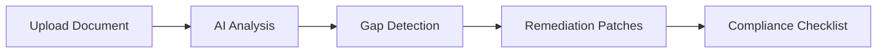

# Governance Analysis

The Governance Analysis feature lets you upload compensation plan documents and automatically identify compliance gaps against SGM's policy library. The system provides coverage grades, gap identification, risk triggers, and ready-to-use remediation language.

## How It Works

1. **Upload**: Drag and drop your compensation document (PDF, DOCX, or TXT)
2. **Analyze**: AI processes the document against 55+ policy requirements
3. **Review**: See coverage grade, gaps, and risk triggers
4. **Remediate**: Copy pre-written patch language to fix gaps
5. **Track**: Download checklist to track remediation progress

## Getting Started

**Path:** `/governance/upload`

### Supported File Types

| Format | Extension | Max Size |
|--------|-----------|----------|
| PDF | `.pdf` | 50 MB |
| Microsoft Word | `.docx`, `.doc` | 50 MB |
| Plain Text | `.txt` | 50 MB |

You can upload up to 5 files at once for batch analysis.

## Uploading Documents

<Steps>
  <Step title="Navigate to Governance Upload">
    Go to Design Mode → Governance → Upload, or directly to `/governance/upload`
  </Step>
  <Step title="Upload your document">
    Either:
    - Drag and drop files onto the upload area
    - Click the upload area to browse your computer
  </Step>
  <Step title="Wait for analysis">
    Analysis takes 6-9 seconds per document. You'll see a progress indicator.
  </Step>
  <Step title="Review results">
    The UI automatically switches to the Analysis tab when complete.
  </Step>
</Steps>

## Understanding Analysis Results

### Key Metrics

| Metric | What It Measures | Good Score |
|--------|------------------|------------|
| **Coverage Grade** | How much of required policy content is present | A or B |
| **Liability Score** | Legal/compliance risk level (1-5 scale) | 1-2 |
| **Total Gaps** | Number of missing or incomplete policy areas | Lower is better |
| **Risk Triggers** | Specific high-risk patterns detected | 0 |

### Coverage Grades

| Grade | Meaning | Color |
|-------|---------|-------|
| **A** | Strong coverage, minor gaps only | Green |
| **B** | Good coverage, some gaps to address | Yellow |
| **C** | Significant gaps requiring attention | Red |

### Gap Severity Levels

| Severity | Description | Priority |
|----------|-------------|----------|
| **Critical** | Legal/regulatory risk, immediate action needed | Fix first |
| **High** | Significant compliance gap | Fix soon |
| **Medium** | Notable omission, should address | Plan to fix |
| **Low** | Minor improvement opportunity | Optional |

## Working with Gaps

Each identified gap includes:

- **Title**: What's missing or incomplete
- **Severity**: Critical, High, Medium, or Low
- **Evidence**: Quotes from your document showing the gap
- **Recommended Language**: Pre-written text to address the gap

### Filtering Gaps

Use the severity filter to focus on specific priorities:
- Show all gaps
- Critical only
- High and above
- Medium and above

### Applying Patches

For each gap, you can:

1. **Copy Language**: Click to copy the recommended patch text
2. **View Details**: Expand to see full context and customization notes
3. **Mark Applied**: Track which gaps you've addressed

## Viewing Patches

**Path:** Click "View Patches" or switch to the Patches tab

The Patches view shows all 50+ remediation language templates:

- Organized by severity
- Includes customization notes
- Shows state-specific compliance considerations
- Downloadable as a single file

### Patch Components

Each patch includes:

| Component | Purpose |
|-----------|---------|
| **Title** | Policy area addressed |
| **Severity** | How critical this patch is |
| **Language** | Ready-to-use policy text |
| **Customization Notes** | What to modify for your situation |
| **State Considerations** | Jurisdiction-specific requirements |

## Downloading Outputs

### Remediation Checklist

Click **Checklist** to download a tracking document with:

- All gaps numbered and categorized
- Severity indicators
- Status checkboxes (Pending, In Progress, Complete)
- Print-ready format

### All Patches

Click **Download All Patches** to get a text file with all remediation language organized by category.

## Best Practices

<AccordionGroup>
  <Accordion title="Before uploading">
    - Ensure documents are the latest version
    - Include the full plan document, not excerpts
    - Remove password protection from PDFs
  </Accordion>
  <Accordion title="Reviewing results">
    - Start with Critical and High severity gaps
    - Note any state-specific requirements for your jurisdiction
    - Cross-reference with your legal/compliance team
  </Accordion>
  <Accordion title="Applying patches">
    - Customize language for your organization's terminology
    - Have legal review critical patches before implementation
    - Update document version after applying patches
  </Accordion>
</AccordionGroup>

## Batch Analysis

When uploading multiple documents:

1. All files are queued for analysis
2. Each file processes independently
3. Results appear as each analysis completes
4. Switch between results using the file tabs

## Integration with Policy Library

Gaps detected reference specific policies from the SGM Policy Library:

- Click any policy reference to view the full policy
- See how your document maps to governance requirements
- Identify which policies you're missing coverage for

## Related Features

<CardGroup cols={2}>
  <Card title="Policy Library" icon="book" href="/user-guide/policy-library">
    Browse policies referenced in analysis
  </Card>
  <Card title="Design Mode" icon="compass-drafting" href="/user-guide/modes/design-mode">
    Build governance frameworks
  </Card>
  <Card title="Documents" icon="file" href="/user-guide/documents">
    Manage analyzed documents
  </Card>
</CardGroup>
