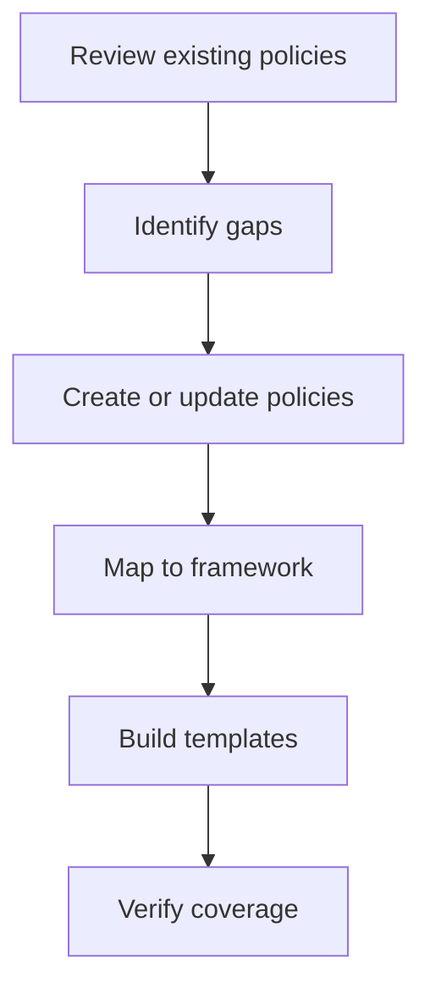

# Design Mode

Design Mode is the authoring environment for governance architects, consultants, and Center of Excellence (CoE) teams. Use it to create, maintain, and analyze the foundational governance artifacts that drive compensation programs.

## When to Use Design Mode

- **Building new governance programs**: Create policies, frameworks, and templates from scratch
- **Updating existing policies**: Revise governance documents during annual reviews
- **Analyzing coverage gaps**: Identify missing policies or framework elements for clients
- **Onboarding new clients**: Assess current state against governance best practices

## Access Requirements

| Role | Access Level |
|------|--------------|
| SUPER_ADMIN | Full access |
| ADMIN | Full access |
| MANAGER | Read-only |

## Key Metrics

The Design Control Center displays real-time metrics:

| Metric | Description |
|--------|-------------|
| **Policies** | Total governance policies in the library |
| **Template Sections** | Reusable plan component sections |
| **Frameworks** | Governance framework pillars defined |
| **Plans Analyzed** | Client plans reviewed for coverage |

## Primary Features

### Policy Library

**Path:** `/policies`

Create and manage governance policies with templates and best practices. Each policy includes:

- Policy statement and rationale
- Compliance requirements
- Related frameworks and controls
- Version history

The library contains 17 Sales Compensation Policies (SCPs) covering:
- Financial controls (clawbacks, draws, payment timing)
- Legal compliance (409A, state wage laws, international)
- HR policies (termination, leave of absence, onboarding)
- Governance processes (exceptions, disputes, crediting)

<Card title="Policy Library Guide" icon="book" href="/user-guide/policy-library">
  Learn how to browse, filter, and manage policies
</Card>

### Plan Templates

**Path:** `/templates`

Build reusable compensation plan templates with modular sections:

- **56 pre-built sections**: Ready-to-use template components
- **Drag-and-drop assembly**: Build templates by combining sections
- **Version control**: Track template changes over time
- **Client customization**: Tailor templates for specific needs

### Governance Framework

**Path:** `/governance-framework`

Define the organizational governance structure:

- **6 governance pillars**: High-level governance categories
- **25 policies mapped**: Policies linked to pillars
- **Compliance mapping**: Controls tied to requirements
- **Visual overview**: Framework diagram view

## Secondary Features

### Governance Matrix

**Path:** `/governance-matrix`

Cross-reference view of policy coverage and approval authorities:

- Which policies apply to which plan types
- Who approves different policy decisions
- Coverage gaps at a glance

### Gap Analysis

**Path:** `/client/[tenantSlug]/gaps`

Analyze client policy coverage against governance best practices:

- Risk scoring for each gap
- Missing policy identification
- Prioritized remediation recommendations

<Card title="Governance Analysis Guide" icon="magnifying-glass" href="/user-guide/governance-analysis">
  Learn how to run comprehensive gap analysis
</Card>

### Framework Primer

**Path:** `/framework/primer`

Interactive learning module for understanding the governance framework:

- Self-paced educational content
- Useful for onboarding new team members
- Client training materials

### Document Links

**Path:** `/links`

Manage relationships between policies, documents, and frameworks:

- Visualize how governance artifacts connect
- Trace policy dependencies
- Understand document relationships

## Typical Workflow

<Steps>
  <Step title="Review existing policies">
    Start in the Policy Library to understand current coverage
  </Step>
  <Step title="Identify gaps">
    Use Gap Analysis to find missing policies or weak areas
  </Step>
  <Step title="Create or update policies">
    Add new policies or revise existing ones as needed
  </Step>
  <Step title="Map policies to framework">
    Ensure all policies link to appropriate governance pillars
  </Step>
  <Step title="Build plan templates">
    Create templates that incorporate your policies
  </Step>
  <Step title="Verify coverage">
    Check the Governance Matrix to confirm complete coverage
  </Step>
</Steps>

## Related Pages

- [Policy Library](/user-guide/policy-library) - Manage governance policies
- [Governance Analysis](/user-guide/governance-analysis) - Run gap analysis
- [Governance Framework Reference](/reference/governance-framework) - Framework details

## Next Steps

<CardGroup cols={2}>
  <Card title="Policy Library" icon="book" href="/user-guide/policy-library">
    Browse and manage policies
  </Card>
  <Card title="Governance Analysis" icon="magnifying-glass" href="/user-guide/governance-analysis">
    Run document gap analysis
  </Card>
  <Card title="Operate Mode" icon="gear" href="/user-guide/modes/operate-mode">
    Switch to daily operations
  </Card>
</CardGroup>
