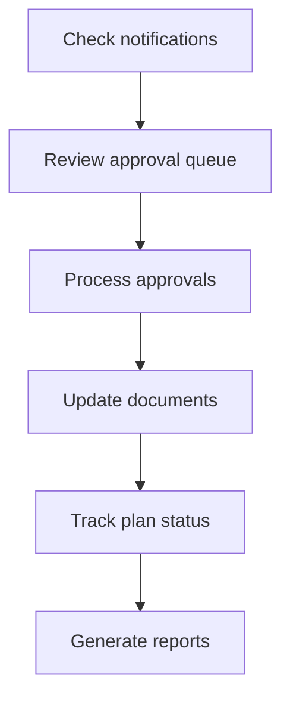

# Operate Mode

Operate Mode is the daily execution environment for compensation teams, RevOps, and administrators. Use it to manage documents, execute plans, process approvals, and track operational activities.

## When to Use Operate Mode

- **Managing documents**: Upload, review, and track governance documents
- **Processing approvals**: Review and approve pending items in the queue
- **Executing plans**: Track active compensation plans and their status
- **Daily operations**: Calendar management, notifications, and reporting

## Access Requirements

| Role | Access Level |
|------|--------------|
| SUPER_ADMIN | Full access |
| ADMIN | Full access |
| MANAGER | Full access |
| USER | Limited (submit and track requests) |
| VIEWER | Read-only |

## Key Metrics

The Operate Control Center displays real-time metrics:

| Metric | Description |
|--------|-------------|
| **Documents** | Total governance documents |
| **Pending Approvals** | Items awaiting review |
| **Active Plans** | Currently executing plans |
| **Notifications** | Unread notifications |

## Primary Features

### Document Library

**Path:** `/documents`

Central repository for all governance documents:

- **48+ documents**: Various governance document types
- **Lifecycle management**: Draft → Review → Approved → Expired
- **Full-text search**: Find documents by content or metadata
- **Version control**: Track document changes over time
- **Relationships**: Link related documents together

<Card title="Documents Guide" icon="file" href="/user-guide/documents">
  Learn how to manage governance documents
</Card>

### Plans Management

**Path:** `/plans`

Create, review, and modify compensation plans:

- **Plan creation wizard**: Step-by-step plan building
- **Status tracking**: Monitor plan progress through workflows
- **Version history**: See all plan revisions
- **Compliance validation**: Check plans against policy requirements

<Card title="Plan Management Guide" icon="clipboard-list" href="/user-guide/plan-management">
  Learn how to create and manage plans
</Card>

### Approvals Queue

**Path:** `/approvals`

Review and approve pending items:

- **SGCC workflows**: Sales Governance Compliance Committee items
- **CRB workflows**: Compensation Review Board items
- **SLA tracking**: Monitor time-to-approval against targets
- **Bulk operations**: Approve multiple items at once

<Card title="Approvals Guide" icon="clipboard-check" href="/user-guide/approvals">
  Learn how to process approvals
</Card>

## Secondary Features

### Calendar

**Path:** `/calendar`

Schedule and track important dates:

- Review deadlines
- Committee meetings
- Plan effective dates
- Expiration reminders

### Reports

**Path:** `/reports`

Generate governance reports:

- Compliance reports
- Activity summaries
- Audit reports
- Custom report builder

<Card title="Search & Reports Guide" icon="chart-bar" href="/user-guide/search-reports">
  Learn how to generate reports
</Card>

### Search & Compare

**Path:** `/compare`

Advanced search and comparison tools:

- Compare document versions side-by-side
- Cross-plan comparison
- Policy coverage analysis

### Notifications

**Path:** `/notifications`

Stay updated on important events:

- Approval requests assigned to you
- Document updates you're following
- Deadline reminders
- System alerts

## Typical Workflow

<Steps>
  <Step title="Check notifications">
    Start each session by reviewing notifications for pending items
  </Step>
  <Step title="Review approval queue">
    Navigate to Approvals to see items waiting for your review
  </Step>
  <Step title="Process approvals">
    Review each item and approve, reject, or request changes
  </Step>
  <Step title="Update documents">
    Make any necessary document updates based on decisions
  </Step>
  <Step title="Track plan status">
    Check active plans and their progress
  </Step>
  <Step title="Generate reports">
    Create reports for stakeholders as needed
  </Step>
</Steps>

## Approval SLA Guidelines

| Committee | Target SLA | Escalation |
|-----------|------------|------------|
| **SGCC** | 5 business days | Auto-escalate at 4 days |
| **CRB** | 3 business days | Auto-escalate at 2 days |

Items approaching SLA deadlines are highlighted in the approval queue.

## Related Pages

- [Documents](/user-guide/documents) - Document management
- [Plan Management](/user-guide/plan-management) - Plan workflows
- [Approvals](/user-guide/approvals) - Approval processing
- [Search & Reports](/user-guide/search-reports) - Reporting

## Next Steps

<CardGroup cols={2}>
  <Card title="Approvals" icon="clipboard-check" href="/user-guide/approvals">
    Process pending approvals
  </Card>
  <Card title="Documents" icon="file" href="/user-guide/documents">
    Manage governance documents
  </Card>
  <Card title="Dispute Mode" icon="scale-balanced" href="/user-guide/modes/dispute-mode">
    Handle cases and exceptions
  </Card>
</CardGroup>
