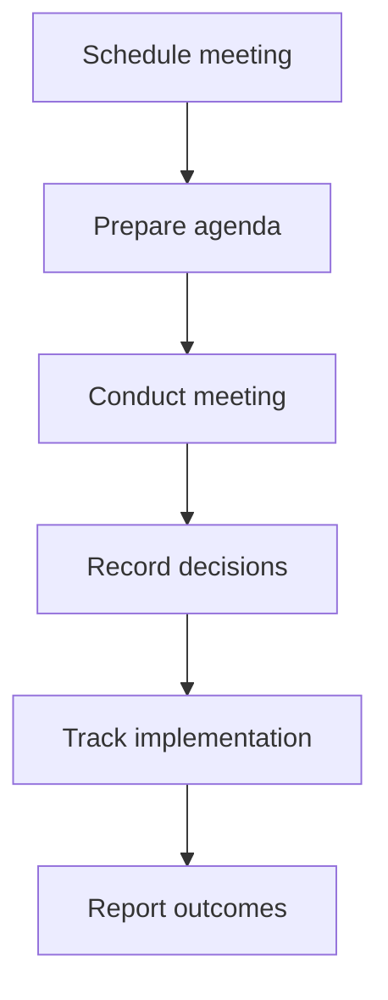

# Oversee Mode

Oversee Mode is the executive oversight environment for leadership, committee members, and compliance officers. Use it to monitor governance health, manage committees, track decisions, and ensure compliance.

## When to Use Oversee Mode

- **Committee management**: Schedule meetings, track decisions, manage members
- **Compliance monitoring**: Review compliance scores and audit findings
- **Executive dashboards**: High-level governance health views
- **Audit preparation**: Review audit trails and compliance documentation

## Access Requirements

| Role | Access Level |
|------|--------------|
| SUPER_ADMIN | Full access |
| ADMIN | Full access |

<Warning>
Oversee Mode is restricted to administrative roles due to the sensitive nature of governance and compliance data.
</Warning>

## Key Metrics

The Governance & Control Center displays:

| Metric | Description |
|--------|-------------|
| **Committees** | Active governance committees |
| **Meetings** | Upcoming committee meetings |
| **Decisions** | Committee decisions this month |
| **Members** | Active committee members |
| **Compliance** | Overall compliance score (%) |

## Primary Features

### Committee Management

**Path:** `/committees`

Manage governance committees:

- **SGCC** (Sales Governance Compliance Committee)
- **CRB** (Compensation Review Board)
- Member management and roles
- Meeting scheduling
- Decision tracking

### Audit Timeline

**Path:** `/audit`

Comprehensive event history:

- All governance actions logged
- Compliance tracking
- Audit trail generation
- Export capabilities for auditors

### Governance Analytics

**Path:** `/analytics`

Executive dashboards and KPIs:

- Governance health metrics
- Trend analysis
- Risk indicators
- Benchmark comparisons

## Governance Committees

### Sales Governance Compliance Committee (SGCC)

| Attribute | Value |
|-----------|-------|
| **Members** | 7 |
| **Meeting Frequency** | Monthly |
| **Quorum** | 4 members |
| **Responsibilities** | Policy approval, compliance oversight, exception review |

The SGCC handles:
- Policy creation and updates
- Compliance standards
- Major exception requests
- Governance framework changes

### Compensation Review Board (CRB)

| Attribute | Value |
|-----------|-------|
| **Members** | 5 |
| **Meeting Frequency** | Bi-weekly |
| **Responsibilities** | Exception approvals, special case reviews, policy recommendations |

The CRB handles:
- Windfall deals
- Special exceptions
- Individual case decisions
- Policy recommendations to SGCC

## Secondary Features

### Decisions Log

**Path:** `/committees/decisions`

Record of all committee decisions:

- Decision details and rationale
- Voting records
- Implementation status
- Follow-up tracking

### Compliance Monitor

**Path:** `/governance-matrix`

Policy coverage and compliance status:

- Coverage heat maps
- Gap identification
- Risk scoring by area

### Client Dashboards

**Path:** `/client/[tenantSlug]`

Client-specific governance views:

- Coverage analysis
- Gap assessment
- Roadmap tracking
- Remediation progress

### Risk Assessment

**Path:** `/analytics?view=risk`

Governance risk scoring:

- Risk identification
- Mitigation tracking
- Trend analysis
- Early warning indicators

## Committee Workflow

<Steps>
  <Step title="Schedule meeting">
    Set meeting date and invite members
  </Step>
  <Step title="Prepare agenda">
    Compile pending items for committee review
  </Step>
  <Step title="Conduct meeting">
    Facilitate discussion and votes on each item
  </Step>
  <Step title="Record decisions">
    Document decisions with rationale in Decisions Log
  </Step>
  <Step title="Track implementation">
    Monitor decision implementation in Audit Timeline
  </Step>
  <Step title="Report outcomes">
    Generate reports for stakeholders in Analytics
  </Step>
</Steps>

## Compliance Framework

| Component | What It Measures |
|-----------|------------------|
| **Policy Coverage** | Percentage of required policies in place |
| **Control Effectiveness** | Validation of control implementation |
| **Audit Findings** | Open findings requiring remediation |
| **Risk Score** | Aggregate governance risk level |

## Compliance Score Calculation

The overall compliance score considers:

- Policy coverage (40% weight)
- Control effectiveness (30% weight)
- Audit finding closure rate (20% weight)
- Risk mitigation progress (10% weight)

## Audit Preparation

For audits, Oversee Mode provides:

1. **Audit Timeline**: Complete history of all governance actions
2. **Decision Log**: Documentation of committee decisions
3. **Policy Library**: Current policy versions with history
4. **Compliance Reports**: Pre-built audit reports

Export any view to PDF or CSV for auditor review.

## Related Pages

- [Committees Reference](/reference/governance-framework) - Committee structure details
- [Approvals](/user-guide/approvals) - Approval workflows
- [Dispute Mode](/user-guide/modes/dispute-mode) - Case escalations

## Next Steps

<CardGroup cols={2}>
  <Card title="Governance Framework" icon="sitemap" href="/reference/governance-framework">
    Review framework structure
  </Card>
  <Card title="API Reference - Audit" icon="code" href="/api-reference/audit">
    Audit API documentation
  </Card>
  <Card title="Design Mode" icon="compass-drafting" href="/user-guide/modes/design-mode">
    Update policies and frameworks
  </Card>
</CardGroup>
