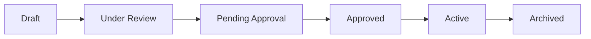

# Plan Management

Plan Management lets you create, review, and track compensation plans throughout their lifecycle. Use templates to standardize plan creation and ensure compliance with governance policies.

## Accessing Plan Management

**Path:** `/plans`

Navigate via: Operate Mode → Plans, or directly to `/plans`

## Plan Lifecycle

Plans progress through these stages:

| Status | Description | Who Can Edit |
|--------|-------------|--------------|
| **Draft** | Work in progress | Authors |
| **Under Review** | Being reviewed by stakeholders | Reviewers (comments only) |
| **Pending Approval** | In approval workflow | No edits |
| **Approved** | Passed approval, ready to activate | No edits |
| **Active** | Currently in effect | Requires change workflow |
| **Archived** | No longer in use | Read-only |

## Browsing Plans

### Plan List

The plan list shows:
- Plan name and ID
- Status badge
- Plan type (e.g., Sales, Overlay, Management)
- Effective dates
- Owner
- Last updated

### Filtering

Filter plans by:
- **Status**: Draft, Under Review, Pending Approval, Approved, Active, Archived
- **Type**: Sales, Overlay, Management, etc.
- **Owner**: Plan creator
- **Date range**: Effective dates

### Data Types

Plans display a data type badge:
- **Demo** (orange): Sample plans for training
- **Template** (teal): Reusable plan templates
- **Client** (green): Production client plans

## Creating a Plan

<Steps>
  <Step title="Start a new plan">
    Click **+ New Plan** in the plans toolbar
  </Step>
  <Step title="Choose a template">
    Select from 56 available templates or start blank
  </Step>
  <Step title="Fill in plan details">
    - Plan name and description
    - Effective dates
    - Plan type
    - Target participants
  </Step>
  <Step title="Build plan sections">
    Add sections from the template library or create custom sections
  </Step>
  <Step title="Validate compliance">
    Run compliance check against policy requirements
  </Step>
  <Step title="Save draft">
    Save to continue editing later
  </Step>
</Steps>

## Plan Templates

SGM includes 56 pre-built plan sections you can combine:

| Section Category | Examples |
|------------------|----------|
| **Eligibility** | Role requirements, start dates, status rules |
| **Compensation Structure** | Base, variable, OTE definitions |
| **Quotas** | Quota assignment, attainment calculation |
| **Commissions** | Rate tables, accelerators, caps |
| **Bonuses** | SPIF rules, management bonuses |
| **Timing** | Payment schedules, true-up periods |
| **Policies** | Clawback, termination, leave rules |

### Using Templates

1. Browse templates by category
2. Preview template content
3. Add selected sections to your plan
4. Customize text for your needs
5. Reorder sections as needed

## Plan Sections

Each plan consists of sections that define specific aspects:

### Section Structure

| Component | Description |
|-----------|-------------|
| **Title** | Section heading |
| **Content** | Policy or procedure text |
| **Variables** | Placeholders for customization |
| **Policy References** | Links to governance policies |
| **Notes** | Internal comments (not in final document) |

### Editing Sections

In the section editor:
- Rich text formatting
- Variable insertion
- Policy reference linking
- Preview mode

## Compliance Validation

Before submitting a plan for approval, validate compliance:

<Steps>
  <Step title="Run compliance check">
    Click **Validate Compliance** in the plan editor
  </Step>
  <Step title="Review results">
    See which policy requirements are met or missing
  </Step>
  <Step title="Address gaps">
    Add missing sections or language to meet requirements
  </Step>
  <Step title="Re-validate">
    Run again to confirm all requirements are met
  </Step>
</Steps>

### Compliance Results

| Status | Meaning |
|--------|---------|
| ✅ **Compliant** | All requirements met |
| ⚠️ **Warnings** | Minor issues to review |
| ❌ **Non-compliant** | Required content missing |

## Plan Approval

When a plan is ready:

<Steps>
  <Step title="Submit for review">
    Change status to **Under Review**
  </Step>
  <Step title="Stakeholder review">
    Reviewers comment and suggest changes
  </Step>
  <Step title="Address feedback">
    Make revisions based on comments
  </Step>
  <Step title="Submit for approval">
    Route to SGCC or CRB for formal approval
  </Step>
  <Step title="Approval decision">
    Committee approves, requests changes, or rejects
  </Step>
</Steps>

## Version History

SGM tracks all plan changes:

- Each save creates a new version
- Compare any two versions
- See who made changes and when
- Revert to previous versions if needed

### Comparing Versions

1. Open the plan detail view
2. Click **Version History**
3. Select two versions to compare
4. View side-by-side diff
5. Optionally revert to an older version

## Document Generation

Generate formatted documents from plans:

<Steps>
  <Step title="Open plan">
    Navigate to the plan you want to export
  </Step>
  <Step title="Click Generate Document">
    Choose output format
  </Step>
  <Step title="Select options">
    - Include/exclude sections
    - Include/exclude internal notes
    - Cover page options
  </Step>
  <Step title="Download">
    Save the generated document
  </Step>
</Steps>

### Output Formats

| Format | Use Case |
|--------|----------|
| **PDF** | Distribution to participants |
| **Word** | Further editing |
| **Markdown** | Integration with other systems |

## Plan Actions

| Action | When to Use |
|--------|-------------|
| **Duplicate** | Create a new plan based on existing one |
| **Archive** | Retire an inactive plan |
| **Compare** | See differences between two plans |
| **Export** | Download plan in various formats |

## Related Features

<CardGroup cols={2}>
  <Card title="Approvals" icon="clipboard-check" href="/user-guide/approvals">
    Process plan approvals
  </Card>
  <Card title="Policy Library" icon="book" href="/user-guide/policy-library">
    Reference policies in plans
  </Card>
  <Card title="Documents" icon="file" href="/user-guide/documents">
    Store generated documents
  </Card>
  <Card title="Governance Analysis" icon="magnifying-glass" href="/user-guide/governance-analysis">
    Validate plan compliance
  </Card>
</CardGroup>
