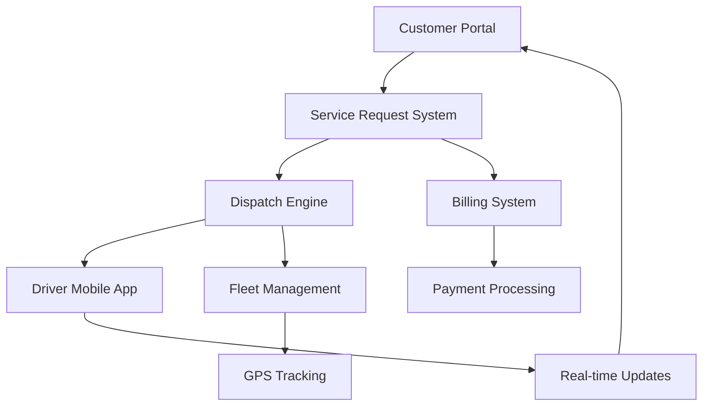

## What is TowEdge Platform?

TowEdge Platform is a comprehensive **towing industry operations management system** designed to streamline every aspect of towing business operations, from service request intake to dispatch optimization, driver management, and customer billing.

<CardGroup cols={2}>
  <Card
    title="Service Request Management"
    icon="phone"
    href="/features/service-requests"
  >
    Automated intake, prioritization, and tracking of towing requests
  </Card>
  <Card
    title="Driver & Vehicle Tracking"
    icon="location-dot"
    href="/features/driver-tracking"
  >
    Real-time GPS tracking and fleet visibility
  </Card>
  <Card
    title="Customer Portal"
    icon="users"
    href="/features/customer-portal"
  >
    Self-service portal for request tracking and account management
  </Card>
  <Card
    title="Dispatch Optimization"
    icon="route"
    href="/features/dispatch-optimization"
  >
    AI-powered dispatch routing and driver assignment
  </Card>
</CardGroup>

## Key Features

<AccordionGroup>
  <Accordion icon="clipboard-list" title="Service Request Management">
    Comprehensive intake system for towing requests with automated prioritization, status tracking, and customer notifications. Supports multiple request types including roadside assistance, vehicle recovery, and long-distance towing.
  </Accordion>

  <Accordion icon="truck" title="Driver & Vehicle Tracking">
    Real-time GPS tracking of drivers and tow trucks with live map visualization. Monitor vehicle location, status, and availability. Track driver performance and service completion times.
  </Accordion>

  <Accordion icon="user-circle" title="Customer Portal">
    Self-service portal where customers can submit requests, track service status in real-time, view service history, manage account information, and access invoices. Mobile-responsive design for on-the-go access.
  </Accordion>

  <Accordion icon="dollar-sign" title="Billing & Invoicing">
    Automated billing system with customizable rate cards, service-based pricing, and multiple payment options. Generate professional invoices, process payments, and track receivables. Integration with popular payment processors.
  </Accordion>

  <Accordion icon="sitemap" title="Dispatch Optimization">
    AI-powered dispatch system that automatically assigns jobs to the nearest available driver. Optimize routes for efficiency, reduce response times, and maximize fleet utilization. Smart load balancing across drivers.
  </Accordion>

  <Accordion icon="chart-line" title="Analytics & Reporting">
    Comprehensive reporting dashboard with key performance metrics including response times, job completion rates, driver performance, revenue analytics, and customer satisfaction scores. Export reports in multiple formats.
  </Accordion>
</AccordionGroup>

## Platform Architecture

### Workflow Overview

1. **Request Intake**: Customer submits towing request via portal, phone, or app
2. **Dispatch**: System assigns job to optimal driver based on location and availability
3. **Service Delivery**: Driver receives assignment, navigates to location, completes service
4. **Billing**: System generates invoice, processes payment, updates customer account
5. **Analytics**: Track performance metrics and generate operational insights

## Quick Links

<CardGroup cols={2}>
  <Card
    title="Quickstart"
    icon="rocket"
    href="/docs/quickstart"
  >
    Get started with TowEdge in 5 minutes
  </Card>
  <Card
    title="Architecture"
    icon="sitemap"
    href="/docs/architecture"
  >
    Understand the platform architecture
  </Card>
  <Card
    title="API Reference"
    icon="code"
    href="/api-reference/overview"
  >
    Explore the TowEdge API
  </Card>
  <Card
    title="Customer Portal"
    icon="users"
    href="/docs/customers/portal"
  >
    Learn about customer self-service features
  </Card>
</CardGroup>

## Industry Benefits

<CardGroup cols={2}>
  <Card title="Faster Response Times" icon="gauge-high">
    Reduce average response time by 40% with optimized dispatch
  </Card>
  <Card title="Improved Customer Satisfaction" icon="face-smile">
    Real-time tracking and updates keep customers informed
  </Card>
  <Card title="Increased Revenue" icon="arrow-trend-up">
    Handle 30% more jobs with better fleet utilization
  </Card>
  <Card title="Operational Efficiency" icon="gears">
    Automate workflows and reduce administrative overhead
  </Card>
</CardGroup>

## Core Capabilities

| Feature | Description |
|---------|-------------|
| **Service Request Management** | Multi-channel intake, automated routing, priority handling |
| **Driver Tracking** | Real-time GPS, performance metrics, availability status |
| **Vehicle Tracking** | Fleet visibility, maintenance scheduling, utilization reports |
| **Customer Portal** | Self-service request submission, status tracking, account management |
| **Billing System** | Automated invoicing, payment processing, rate management |
| **Dispatch Optimization** | AI-powered routing, load balancing, efficiency analytics |
| **Mobile Apps** | iOS/Android apps for drivers and customers |
| **Reporting** | KPI dashboards, custom reports, data export |

## Use Cases

<Check>**Towing Companies** - Streamline operations for single or multi-location towing businesses</Check>
<Check>**Roadside Assistance** - Manage roadside service calls and dispatch efficiently</Check>
<Check>**Fleet Services** - Coordinate towing for commercial fleet operators</Check>
<Check>**Municipal Contracts** - Handle government contracts with compliance tracking</Check>
<Check>**Insurance Partnerships** - Integrate with insurance providers for claims processing</Check>

## Technology Stack

| Component | Technology |
|-----------|-----------|
| **Frontend** | Next.js 15, React 19, TypeScript |
| **Backend** | Node.js, Prisma ORM |
| **Database** | PostgreSQL |
| **Real-time** | WebSockets, Push notifications |
| **Maps & GPS** | Google Maps API, GPS tracking integration |
| **Payments** | Stripe, Square, PayPal integration |
| **Mobile** | React Native (iOS/Android) |
| **Hosting** | Vercel, cloud infrastructure |

## Next Steps

<Steps>
  <Step title="Read the Quickstart">
    Get TowEdge running and configured for your business
  </Step>
  <Step title="Configure Service Types">
    Set up your service offerings and rate cards
  </Step>
  <Step title="Add Drivers and Vehicles">
    Onboard your fleet and driver team
  </Step>
  <Step title="Set Up Customer Portal">
    Customize the portal with your branding
  </Step>
  <Step title="Integrate Payment Processing">
    Connect your preferred payment processor
  </Step>
  <Step title="Go Live">
    Start accepting and dispatching service requests
  </Step>
</Steps>

## Support & Resources

<CardGroup cols={2}>
  <Card title="Documentation" icon="book">
    Comprehensive guides and tutorials
  </Card>
  <Card title="API Reference" icon="code">
    Complete API documentation
  </Card>
  <Card title="Video Tutorials" icon="video">
    Step-by-step video guides
  </Card>
  <Card title="24/7 Support" icon="headset">
    Email and phone support available
  </Card>
</CardGroup>
